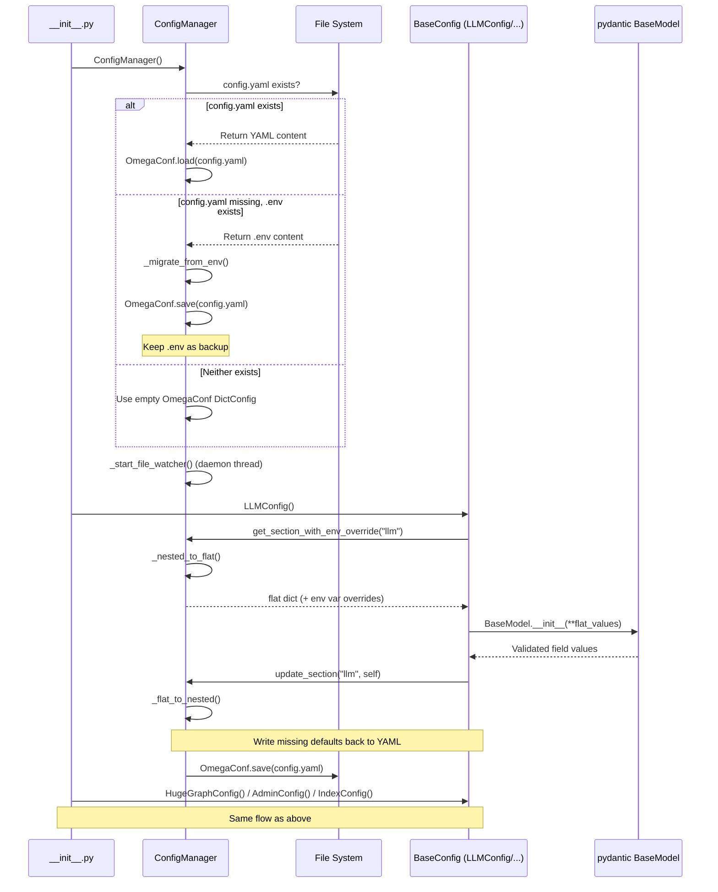
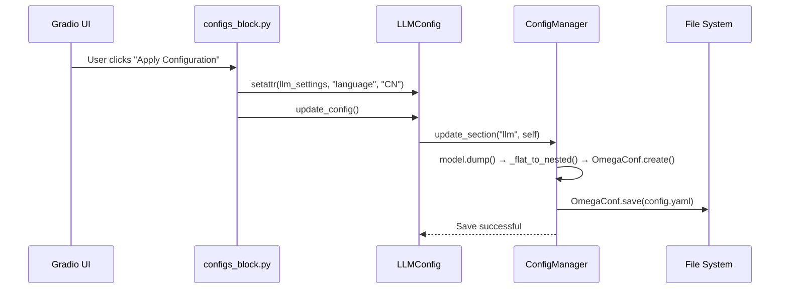
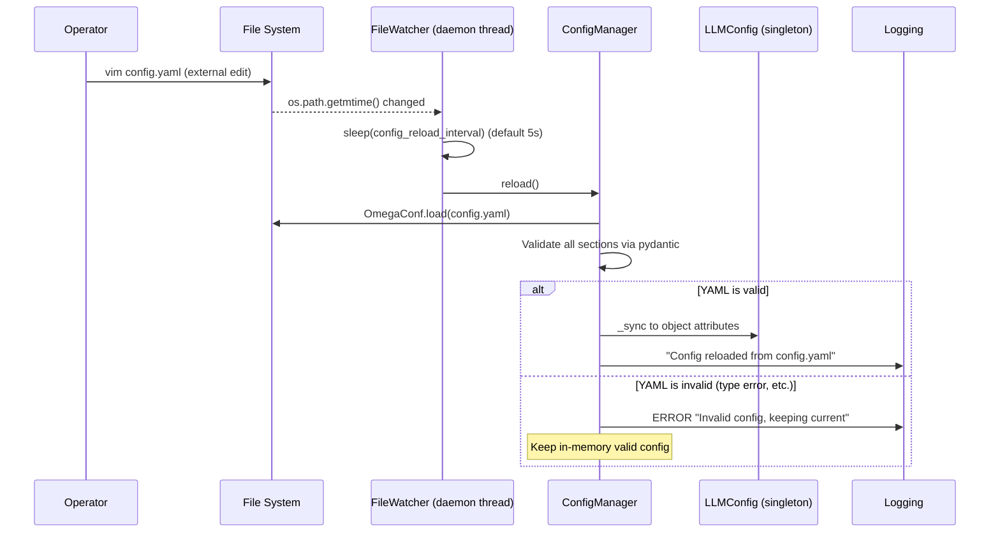

# Design Document: Migrate .env Configuration to YAML with OmegaConf

## 1. Overview

### 1.1. Objective

Migrate hugegraph-llm's configuration storage from flat `.env` (pydantic-settings + python-dotenv) to structured `config.yaml` (OmegaConf), while maintaining full backward compatibility with the existing Python API and supporting runtime hot-reload.

### 1.2. Scope

- **In-Scope**:
  - Introduce OmegaConf as the YAML config read/write framework
  - Refactor `BaseConfig` from `BaseSettings` to `BaseModel`
  - Create `ConfigManager` singleton to manage YAML lifecycle
  - Auto-migrate from `.env` to `config.yaml` on first startup
  - Runtime file change detection and auto-reload (polling-based)
  - Environment variable override for sensitive info (API keys, etc.)
  - Replace `update_env()` → `update_config()` in Gradio UI
  - Adapt CLI `generate.py`
  - Update `config.md` documentation
  - Nested YAML structure via flat↔nested bidirectional mapping
- **Out-of-Scope**:
  - Config version migration strategy (e.g. auto-upgrade on schema change)
  - Multi-file config support

### 1.3. Related Requirements

References all 9 functional requirements (U1-U11, E1-E12, X1-X4) in `.workflow/yaml-config-migration/requirements.md`.

## 2. Architecture

### 2.1. Architecture Diagrams

**System Startup Flow (Sequence Diagram)**:



**Config Modification Flow (Gradio UI)**:



**Hot-Reload Flow**:



### 2.2. Component Diagram

```mermaid
graph TD
    subgraph "Config System (Refactored)"
        CM[ConfigManager Singleton]
        YAML[config.yaml]
        ENV[.env legacy]
        FW[FileWatcher daemon thread]

        subgraph "pydantic Model Layer (Schema & Validation)"
            LLC[LLMConfig]
            HGC[HugeGraphConfig]
            ADC[AdminConfig]
            IDC[IndexConfig]
        end

        subgraph "Consumer Layer (46+ files, unchanged)"
            API[API / Flows / Nodes]
            UI[Gradio UI]
            CLI[CLI generate.py]
        end
    end

    CM -->|OmegaConf.load/save| YAML
    CM -->|First-run migration| ENV
    CM -->|Periodic polling| FW
    FW -->|Trigger reload on change| CM

    LLC -->|get_section / update_section| CM
    HGC -->|get_section / update_section| CM
    ADC -->|get_section / update_section| CM
    IDC -->|get_section / update_section| CM

    API -->|llm_settings.language attr access| LLC
    UI -->|update_config()| LLC
    CLI -->|generate_yaml()| LLC
```

### 2.3. Design Decisions & Trade-offs

- **Decision 1: Nested YAML key structure (via flat↔nested mapping)**
  - **Rationale**: User explicitly requested nested YAML format (e.g. `ollama: extract_port: 11434` rather than `ollama_extract_port: 11434`) for improved readability and organization. 46 consumer files remain compatible: pydantic field names stay flat (`ollama_extract_port`), with automatic conversion via `_flat_to_nested_mapping` ClassVar during YAML read/write.
  - **Trade-off**: Requires bidirectional conversion logic (`_flat_to_nested()` / `_nested_to_flat()`) in ConfigManager, adding moderate complexity. Conversion uses dot-notation path mappings (e.g. `{"ollama_extract_port": "ollama.extract.port"}`).
  - **YAML format**:
    ```yaml
    llm:
      language: EN
      openai:
        chat:
          api_base: https://api.openai.com/v1
          api_key: null
          language_model: gpt-4.1-mini
      ollama:
        chat:
          host: 127.0.0.1
          port: 11434
    hugegraph:
      graph:
        url: 127.0.0.1:8080
      query:
        max_graph_path: 10
    ```

- **Decision 2: OmegaConf + pydantic BaseModel (not BaseSettings)**
  - **Rationale**: pydantic-settings `BaseSettings` is tightly coupled with `.env`. Switching to plain `BaseModel` means pydantic handles only schema/validation/defaults, while OmegaConf handles file I/O.
  - **Trade-off**: Lose `BaseSettings` automatic env-var reading. Implement explicit fallback chain via ConfigManager.
  - **Priority**: `os.environ > config.yaml > pydantic defaults`. Env vars have the highest priority, aligning with 12-factor app and container/K8s deployment conventions.

- **Decision 3: ConfigManager singleton pattern**
  - **Rationale**: Single global config source, avoids multi-instance read/write conflicts. Single background file-watcher thread.
  - **Trade-off**: Global state introduces coupling. But configuration is inherently a global concern — singleton is a reasonable choice.

- **Decision 4: Polling (not watchdog) for file monitoring**
  - **Rationale**: Zero extra dependencies (`os.path.getmtime()` from stdlib), cross-platform compatible. watchdog requires additional installation and can be unstable in certain WSL/Docker environments.
  - **Trade-off**: Not real-time detection (interval controlled by `config_reload_interval`, default 5s). Sufficient for config file use case.

- **Decision 5: pydantic-based type conversion during .env migration**
  - **Rationale**: All values in `.env` are strings. Constructing pydantic model instances (e.g. `LLMConfig(openai_chat_tokens="8192")`) lets pydantic auto-convert `"8192"` → `8192` (int), preserving correct types when writing to YAML.
  - **Trade-off**: Depends on pydantic's type coercion rules. Migration fails and logs errors for uncoercible fields (e.g. misspelled enum values).

## 3. Data Model

### 3.1. `config.yaml` File Structure

```yaml
# config.yaml — hugegraph-llm user configuration
# Auto-generated and managed by ConfigManager

llm:
  language: EN
  chat_llm_type: openai
  extract_llm_type: openai
  text2gql_llm_type: openai
  embedding_type: openai
  reranker_type: null
  keyword_extract_type: llm
  window_size: 3
  hybrid_llm_weights: 0.5
  # OpenAI (nested)
  openai:
    chat:
      api_base: https://api.openai.com/v1
      api_key: null
      language_model: gpt-4.1-mini
      tokens: 8192
    extract:
      api_base: https://api.openai.com/v1
      api_key: null
      language_model: gpt-4.1-mini
      tokens: 256
    text2gql:
      api_base: https://api.openai.com/v1
      api_key: null
      language_model: gpt-4.1-mini
      tokens: 4096
    embedding:
      api_base: https://api.openai.com/v1
      api_key: null
      model: text-embedding-3-small
  # Ollama (nested)
  ollama:
    chat:
      host: 127.0.0.1
      port: 11434
      language_model: null
    extract:
      host: 127.0.0.1
      port: 11434
      language_model: null
    text2gql:
      host: 127.0.0.1
      port: 11434
      language_model: null
    embedding:
      host: 127.0.0.1
      port: 11434
      model: null
  # LiteLLM (nested)
  litellm:
    chat:
      api_key: null
      api_base: null
      language_model: openai/gpt-4.1-mini
      tokens: 8192
    # ... (extract, text2gql, embedding similar)

hugegraph:
  graph:
    url: 127.0.0.1:8080
    name: hugegraph
    user: admin
    pwd: xxx
    space: null
  query:
    limit_property: "False"
    max_graph_path: 10
    max_graph_items: 30
    edge_limit_pre_label: 8
  vector:
    dis_threshold: 0.9
    topk_per_keyword: 1
  rerank:
    topk_return_results: 20

admin:
  login:
    enable: "False"
    user_token: "4321"
    admin_token: "xxxx"
  config_reload_interval: 5

index:
  qdrant:
    host: null
    port: 6333
    api_key: null
  milvus:
    host: null
    port: 19530
    user: ""
    password: ""
  cur_vector_index: "Faiss"
```

### 3.2. ConfigManager Internal Structure

```python
class ConfigManager:
    """Singleton. Manages OmegaConf DictConfig lifecycle."""

    _instance: ClassVar[Optional["ConfigManager"]] = None
    _yaml_path: str          # config.yaml path (os.getcwd()/config.yaml)
    _cfg: DictConfig         # OmegaConf config tree
    _watcher_thread: Thread  # Background file-watcher thread
    _watching: bool          # Controls watcher thread lifecycle

    def load(self) -> DictConfig: ...
    def save(self) -> None: ...
    def get_section(self, name: str) -> DictConfig: ...
    def update_section(self, name: str, model: BaseModel) -> None: ...
    def reload(self) -> bool: ...  # Hot-reload, returns success
    def _migrate_from_env(self) -> DictConfig: ...
    def _start_file_watcher(self) -> None: ...
    def _stop_file_watcher(self) -> None: ...
```

### 3.3. BaseConfig Refactor

```python
class BaseConfig(BaseModel):  # No longer BaseSettings
    _config_section: ClassVar[str] = ""  # Subclass sets: "llm", "hugegraph", etc.
    _flat_to_nested_mapping: ClassVar[dict] = {}  # Flat field → nested dot-path

    def __init__(self, **data):
        # 1. Load from ConfigManager (nested YAML → flat via _nested_to_flat)
        # 2. Apply environment variable overrides (higher priority than YAML)
        # 3. Call super().__init__() for pydantic validation
        # 4. Write missing defaults back to ConfigManager → YAML (flat → nested via _flat_to_nested)

    def update_config(self):
        # Sync current pydantic field values to ConfigManager → save YAML

    def generate_yaml(self):
        # Generate YAML section with default values

    def check_config(self):
        # Sync from YAML to object (replaces old check_env)
```

## 4. API Design

All internal Python APIs. No HTTP endpoint changes.

### 4.1. ConfigManager API

```python
# Get singleton
cfg_mgr = ConfigManager()

# Read section (returns OmegaConf DictConfig)
llm_cfg: DictConfig = cfg_mgr.get_section("llm")
print(llm_cfg.openai.chat.tokens)  # 8192 (int, not string)

# Write section (sync from pydantic model)
cfg_mgr.update_section("llm", llm_settings)

# Hot-reload (called by FileWatcher)
success: bool = cfg_mgr.reload()
```

### 4.2. BaseConfig Public API (backward-compatible)

```python
# Existing API — unchanged
llm_settings.language           # Attribute read
llm_settings.language = "CN"    # Attribute write
llm_settings.update_config()    # Replaces update_env(), persists to YAML
llm_settings.generate_yaml()    # Replaces generate_env(), generates YAML
llm_settings.check_config()     # Replaces check_env(), syncs from YAML

# Deprecated API (internal impl changed, method names kept to avoid breakage)
llm_settings.update_env()       # → delegates to update_config()
```

## 5. Core Logic Implementation

### 5.1. ConfigManager Initialization

```
ConfigManager.__init__():
  1. Determine config.yaml path = os.path.join(os.getcwd(), "config.yaml")
  2. Load .env into os.environ (for backward compat and override priority)
  3. IF config.yaml exists:
       OmegaConf.load(config.yaml)
     ELSE IF .env exists:
       _migrate_from_env()  # Read .env → build DictConfig → save
     ELSE:
       _cfg = OmegaConf.create({})  # Empty, models fill in defaults later
  4. _start_file_watcher()  # Start background hot-reload thread
```

### 5.2. .env Migration Logic

```
_migrate_from_env():
  1. env_data = dotenv_values(".env")  # {KEY: value} uppercase keys
  2. sections = {"llm": LLMConfig, "hugegraph": HugeGraphConfig, ...}
  3. FOR section_name, model_class IN sections:
       model_fields = model_class.model_fields.keys()  # Lowercase field names
       section_data = {}
       FOR env_key, env_value IN env_data:
         IF env_key.lower() IN model_fields:
           section_data[env_key.lower()] = env_value
       # Validate + type convert via pydantic
       model_instance = model_class(**section_data)
       full_dump = model_instance.model_dump()
       # Only keep fields that were in .env (don't leak env var values into YAML)
       filtered = {k: v for k, v in full_dump.items() if k in section_data}
       # Flat → nested conversion
       nested = _flat_to_nested(filtered, model_class._flat_to_nested_mapping)
       cfg[section_name] = OmegaConf.create(nested)
  4. OmegaConf.save(cfg, "config.yaml")
  5. log.info("Migrated .env → config.yaml")
  6. Keep .env, do not delete
```

Type conversion key point: `.env` has `MAX_GRAPH_PATH=10` (string) → `section_data["max_graph_path"]="10"` → `HugeGraphConfig(max_graph_path="10")` → pydantic auto-converts to `max_graph_path: int = 10` → YAML outputs `max_graph_path: 10` (integer).

### 5.3. Environment Variable Override (env > YAML)

Priority: **os.environ > config.yaml > pydantic defaults**

```
ConfigManager.get_section_with_env_override(section_name, model_class):
  1. yaml_section = _cfg.get(section_name)  # OmegaConf DictConfig (nested)
  2. raw_dict = OmegaConf.to_container(yaml_section)  # Python dict (nested)
  3. # Nested → flat conversion
     section_dict = _nested_to_flat(raw_dict, model_class._flat_to_nested_mapping)
  4. # Override with env vars (env has higher priority)
     FOR field_name, field_info IN model_class.model_fields.items():
       env_var_name = model_class._env_var_map.get(field_name, field_name.upper())
       env_value = os.environ.get(env_var_name)
       IF env_value IS NOT None:
         # Type conversion via pydantic TypeAdapter
         section_dict[field_name] = TypeAdapter(field_info.annotation).validate_python(env_value)
  5. RETURN section_dict  # Flat dict, ready for pydantic BaseModel
```

Specific env var mapping (from requirements U5-U7):
- `OPENAI_API_KEY` → overrides `openai_*_api_key`
- `OPENAI_BASE_URL` → overrides `openai_*_api_base`
- `OPENAI_EMBEDDING_BASE_URL` → overrides `openai_embedding_api_base`
- `CO_API_URL` → overrides `cohere_base_url`
- Qdrant/Milvus connection params ← corresponding env vars

Note: `config.yaml` serves as persistent storage and default value source. Environment variables are used for injecting secrets or overriding in containerized deployments. Editing `config.yaml` does not overwrite already-set environment variables.

### 5.4. File Monitoring & Hot-Reload

```
FileWatcher (background daemon thread):
  interval = cfg.admin.config_reload_interval (default 5, read from YAML)
  IF interval <= 0:
    log.info("Hot reload disabled (config_reload_interval <= 0)")
    RETURN

  last_mtime = os.path.getmtime(config.yaml)
  WHILE _watching:
    sleep(interval)
    current_mtime = os.path.getmtime(config.yaml)
    IF current_mtime != last_mtime:
      last_mtime = current_mtime
      success = ConfigManager.reload()
      IF NOT success:
        log.error("Config reload failed, keeping current in-memory config")
```

```
ConfigManager.reload():
  1. new_cfg = OmegaConf.load(config.yaml)
  2. FOR section_name, model_class IN self._sections:
       raw_dict = OmegaConf.to_container(new_cfg[section_name])
       flat_dict = _nested_to_flat(raw_dict, mapping)
       # Validate via pydantic
       model_class(**flat_dict)
  3. _cfg = new_cfg
  4. FOR section_name, config_obj IN self._reload_targets:
       config_obj.check_config()
  5. log.info("Config reloaded successfully")
  6. RETURN True
  EXCEPT Exception:
    log.error("Invalid config: ...")
    RETURN False  # Keep current in-memory config
```

### 5.5. BaseConfig Initialization Sync

```
BaseConfig.__init__(**data):
  1. cfg_mgr = ConfigManager()
  2. # Load from YAML + env override
     section_data = cfg_mgr.get_section_with_env_override(_config_section, type(self))
     # section_data is already flat (via _nested_to_flat)
  3. # Merge explicitly passed data (highest priority)
     section_data.update(data)
  4. # pydantic validation
     super().__init__(**section_data)
  5. # Write missing defaults back to YAML
     cfg_mgr.update_section(_config_section, self)
     # update_section: model.dump() → _flat_to_nested(mapping) → OmegaConf.create()
     cfg_mgr.save()
```

Note: Step 5 ensures newly added pydantic fields (with defaults) are automatically written to YAML, so users don't need to manually edit after upgrades.

## 6. Non-Functional Requirements

- **Security**: `config.yaml` added to `.gitignore` (same level as `.env`), preventing accidental commit of sensitive info.
- **Performance**: File monitoring uses `os.path.getmtime()` zero-overhead polling. YAML loading only triggered at startup or on change, not impacting normal request performance.
- **Backward Compatibility**: All 46 consumer files using `from hugegraph_llm.config import llm_settings` and `llm_settings.language` attribute access remain unchanged.
- **Error Recovery**: Hot-reload failure retains valid in-memory config, no service interruption. Damaged `config.yaml` at startup falls back to pydantic defaults.

## 7. Test Strategy

- **Unit Tests**:
  - `ConfigManager._migrate_from_env()` — .env fields correctly converted to YAML sections with types
  - `BaseConfig.__init__()` — YAML load, env var fallback, default write-back
  - `BaseConfig.update_config()` — pydantic field changes correctly persisted to YAML
  - `ConfigManager.reload()` — valid/invalid YAML handling
  - `ConfigManager` resilience — empty file, missing file, corrupted file
- **Integration Tests**:
  - First startup (no files) → generates `config.yaml` with defaults
  - `.env` exists → auto-migrates to `config.yaml`
  - Env vars override YAML `None` values
  - Gradio UI config modification → `config.yaml` updated
  - Manual `config.yaml` edit → FileWatcher detects and hot-reloads
- **Regression Tests**:
  - Existing `test_config.py` passes
  - `ruff format --check` + `ruff check` no errors

## 8. Risks & Mitigations

- **Risk 1**: Switching from `BaseSettings` to `BaseModel` — `os.environ.get()` defaults previously written in pydantic field definitions may not be evaluated at the right time.
  - **Mitigation**: ConfigManager explicitly checks `os.environ` in `get_section_with_env_override()`. Field defaults with `os.environ.get()` are removed; actual fallback is controlled by ConfigManager.

- **Risk 2**: Background FileWatcher thread could cause resource leaks or hangs on Python process exit.
  - **Mitigation**: FileWatcher uses `daemon=True` thread, auto-terminates with main process. `_watching` flag enables clean shutdown.

- **Risk 3**: During polling interval, user may save YAML twice, causing a race between reload and a second change detection.
  - **Mitigation**: `reload()` uses `threading.Lock` to prevent concurrent re-entry. Redundant mtime changes during an active reload are skipped.

- **Risk 4**: `AdminConfig` adds a new `config_reload_interval` field — must ensure `.env` migration doesn't lose it (old `.env` won't have it).
  - **Mitigation**: Migration uses `model_dump()` to get all fields (including defaults), so new fields are automatically written to YAML with default values.
