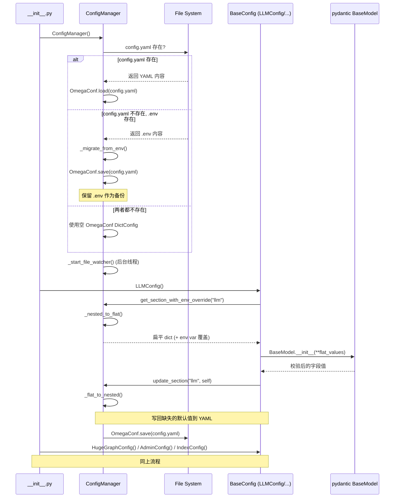
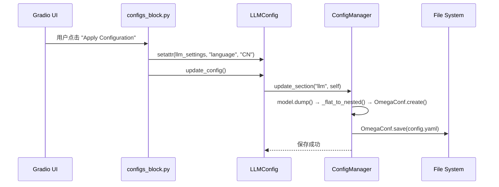
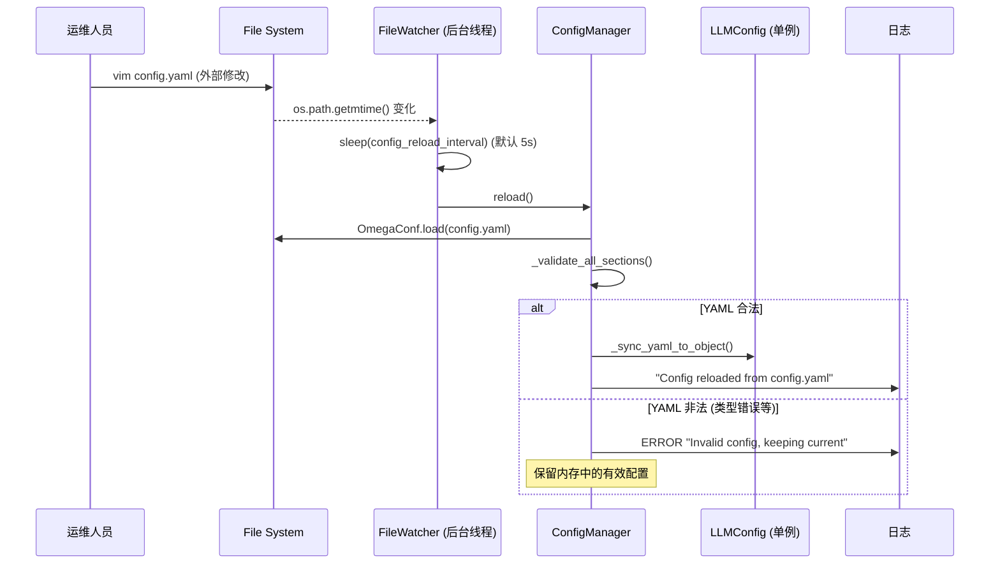

# 设计文档: 将 .env 配置迁移到 YAML (使用 OmegaConf)

## 1. 概述

### 1.1. 目标

将 hugegraph-llm 的配置存储从扁平 `.env` (pydantic-settings + python-dotenv) 迁移到结构化 `config.yaml` (OmegaConf)，同时保持现有 Python API 完全兼容，并支持运行时热加载。

### 1.2. 范围

- **In-Scope**:
  - 引入 OmegaConf 作为 YAML 配置读写框架
  - 重构 `BaseConfig`，从 `BaseSettings` 迁移到 `BaseModel`
  - 创建 `ConfigManager` 单例管理 YAML 生命周期
  - 首次启动时自动从 `.env` 迁移到 `config.yaml`
  - 运行时文件变更检测与自动重载（轮询方式）
  - 环境变量 fallback（API Key 等敏感信息）
  - Gradio UI 中 `update_env()` → `update_config()` 替换
  - CLI `generate.py` 适配
  - `config.md` 文档更新
- **Out-of-Scope**:
  - 配置版本迁移策略（如 config schema 变更时的自动升级）
  - 多配置文件支持

### 1.3. 关联需求

关联 `.workflow/yaml-config-migration/requirements.md` 中全部 9 个功能需求 (U1-U11, E1-E12, X1-X4)。

## 2. 整体架构

### 2.1. 架构图

**系统启动流程 (序列图)**:



**配置修改流程 (Gradio UI)**:



**热加载流程**:



### 2.2. 组件图

```mermaid
graph TD
    subgraph "配置系统 (重构后)"
        CM[ConfigManager Singleton]
        YAML[config.yaml]
        ENV[.env 旧版]
        FW[FileWatcher 后台线程]

        subgraph "pydantic 模型层 (Schema & Validation)"
            LLC[LLMConfig]
            HGC[HugeGraphConfig]
            ADC[AdminConfig]
            IDC[IndexConfig]
        end

        subgraph "消费层 (46+ 文件, 不变)"
            API[API / Flows / Nodes]
            UI[Gradio UI]
            CLI[CLI generate.py]
        end
    end

    CM -->|OmegaConf.load/save| YAML
    CM -->|首次迁移| ENV
    CM -->|定时轮询| FW
    FW -->|检测变更后触发| CM

    LLC -->|get_section / update_section| CM
    HGC -->|get_section / update_section| CM
    ADC -->|get_section / update_section| CM
    IDC -->|get_section / update_section| CM

    API -->|llm_settings.language 属性访问| LLC
    UI -->|update_config()| LLC
    CLI -->|generate_yaml()| LLC
```

### 2.3. 设计决策与权衡

- **决策 1: 嵌套 YAML key 结构 (via flat↔nested mapping)**
  - **理由**: 用户明确要求嵌套 YAML 格式（如 `ollama: extract_port: 11434` 而非 `ollama_extract_port: 11434`），提升可读性和组织性。同时保持 46 个 consumer 文件的兼容性：pydantic 字段名保持扁平（`ollama_extract_port`），通过 `_flat_to_nested_mapping` ClassVar 在读写 YAML 时自动转换。
  - **权衡**: 需要在 ConfigManager 中维护双向转换逻辑（`_flat_to_nested()` / `_nested_to_flat()`），增加了少量复杂度。转换通过 dot-notation path mapping 实现（如 `{"ollama_extract_port": "ollama.extract.port"}`）。
  - **YAML 格式**:
    ```yaml
    llm:
      language: EN
      openai:
        chat:
          api_base: https://api.openai.com/v1
          api_key: null
          language_model: gpt-4.1-mini
      ollama:
        chat:
          host: 127.0.0.1
          port: 11434
    hugegraph:
      graph:
        url: 127.0.0.1:8080
      query:
        max_graph_path: 10
    ```

- **决策 2: OmegaConf + pydantic BaseModel (非 BaseSettings)**
  - **理由**: pydantic-settings 的 `BaseSettings` 与 `.env` 紧耦合。改用纯净 `BaseModel` 后，pydantic 仅负责 schema/校验/默认值，OmegaConf 负责文件 I/O。
  - **权衡**: 失去 `BaseSettings` 自动读取环境变量的能力。通过 ConfigManager 显式实现 fallback 链。
  - **优先级**: `环境变量 (os.environ) > config.yaml > pydantic 默认值`。环境变量作为最高优先级，符合 12-factor app 和容器/K8s 部署惯例。

- **决策 3: ConfigManager 单例模式**
  - **理由**: 全局唯一配置源，避免多实例读写冲突。后台文件监控线程唯一。
  - **权衡**: 全局状态具有紧耦合性。但配置本身就是全局关注点，单例是合理选择。

- **决策 4: 轮询 (polling) 而非 watchdog 进行文件监控**
  - **理由**: 零额外依赖（`os.path.getmtime()` 标准库），跨平台兼容。watchdog 需要额外安装且在某些 WSL/Docker 环境下不稳定。
  - **权衡**: 不是实时检测（间隔由 `config_reload_interval` 控制，默认 5s）。对配置文件场景足够。

- **决策 5: .env 迁移时通过 pydantic 校验进行类型转换**
  - **理由**: .env 中所有值均为字符串。用 pydantic 模型构造实例（如 `LLMConfig(openai_chat_tokens="8192")`）让 pydantic 自动将 `"8192"` → `8192` (int)，再写入 YAML 时保留正确类型。
  - **权衡**: 依赖 pydantic 的类型强制规则。对于无法强制的字段（如拼写错误的枚举值），迁移会失败并记录错误。

## 3. 数据模型

### 3.1. `config.yaml` 文件结构

```yaml
# config.yaml — hugegraph-llm 用户配置
# 由 ConfigManager 自动生成和管理

llm:
  language: EN
  chat_llm_type: openai
  extract_llm_type: openai
  text2gql_llm_type: openai
  embedding_type: openai
  reranker_type: null
  keyword_extract_type: llm
  window_size: 3
  hybrid_llm_weights: 0.5
  # OpenAI (nested)
  openai:
    chat:
      api_base: https://api.openai.com/v1
      api_key: null
      language_model: gpt-4.1-mini
      tokens: 8192
    extract:
      api_base: https://api.openai.com/v1
      api_key: null
      language_model: gpt-4.1-mini
      tokens: 256
    text2gql:
      api_base: https://api.openai.com/v1
      api_key: null
      language_model: gpt-4.1-mini
      tokens: 4096
    embedding:
      api_base: https://api.openai.com/v1
      api_key: null
      model: text-embedding-3-small
  # Ollama (nested)
  ollama:
    chat:
      host: 127.0.0.1
      port: 11434
      language_model: null
    extract:
      host: 127.0.0.1
      port: 11434
      language_model: null
    text2gql:
      host: 127.0.0.1
      port: 11434
      language_model: null
    embedding:
      host: 127.0.0.1
      port: 11434
      model: null
  # LiteLLM (nested)
  litellm:
    chat:
      api_key: null
      api_base: null
      language_model: openai/gpt-4.1-mini
      tokens: 8192
    # ... (extract, text2gql, embedding 类似)

hugegraph:
  graph:
    url: 127.0.0.1:8080
    name: hugegraph
    user: admin
    pwd: xxx
    space: null
  query:
    limit_property: "False"
    max_graph_path: 10
    max_graph_items: 30
    edge_limit_pre_label: 8
  vector:
    dis_threshold: 0.9
    topk_per_keyword: 1
  rerank:
    topk_return_results: 20

admin:
  login:
    enable: "False"
    user_token: "4321"
    admin_token: "xxxx"
  config_reload_interval: 5

index:
  qdrant:
    host: null
    port: 6333
    api_key: null
  milvus:
    host: null
    port: 19530
    user: ""
    password: ""
  cur_vector_index: "Faiss"
```

### 3.2. ConfigManager 内部结构

```python
class ConfigManager:
    """单例。管理 OmegaConf DictConfig 生命周期。"""

    _instance: ClassVar[Optional["ConfigManager"]] = None
    _yaml_path: str          # config.yaml 路径 (os.getcwd()/config.yaml)
    _cfg: DictConfig         # OmegaConf 配置树
    _watcher_thread: Thread  # 后台文件监控线程
    _watching: bool          # 控制监控线程运行

    def load(self) -> DictConfig: ...
    def save(self) -> None: ...
    def get_section(self, name: str) -> DictConfig: ...
    def update_section(self, name: str, model: BaseModel) -> None: ...
    def reload(self) -> bool: ...  # 热加载, 返回是否成功
    def _migrate_from_env(self) -> DictConfig: ...
    def _start_file_watcher(self) -> None: ...
    def _stop_file_watcher(self) -> None: ...
```

### 3.3. BaseConfig 重构

```python
class BaseConfig(BaseModel):  # 不再是 BaseSettings
    _config_section: ClassVar[str] = ""  # 子类定义: "llm", "hugegraph" 等

    def __init__(self, **data):
        # 1. 从 ConfigManager 获取对应 YAML section
        # 2. 合并环境变量 fallback (仅对标记字段)
        # 3. 调用 super().__init__() 进行 pydantic 校验
        # 4. 将缺失的默认值写回 ConfigManager → YAML

    def update_config(self):
        # 将当前 pydantic 字段值同步到 ConfigManager → 保存 YAML

    def generate_yaml(self):
        # 生成包含默认值的 YAML section

    def check_config(self):
        # 从 YAML 同步到对象 (替代原 check_env)
```

## 4. API 接口设计

所有内部 Python API，无 HTTP 端点变更。

### 4.1. ConfigManager API

```python
# 获取单例
cfg_mgr = ConfigManager()

# 读取 section (返回 OmegaConf DictConfig)
llm_cfg: DictConfig = cfg_mgr.get_section("llm")
print(llm_cfg.language)  # "EN"
print(llm_cfg.openai_chat_tokens)  # 8192 (int, 非字符串)

# 写入 section (从 pydantic model 同步)
cfg_mgr.update_section("llm", llm_settings)

# 热加载 (由 FileWatcher 调用)
success: bool = cfg_mgr.reload()
```

### 4.2. BaseConfig 公开 API (保持兼容)

```python
# 原有 API — 不变
llm_settings.language           # 属性读取
llm_settings.language = "CN"    # 属性写入
llm_settings.update_config()    # 替代 update_env(), 持久化到 YAML
llm_settings.generate_yaml()    # 替代 generate_env(), 生成 YAML
llm_settings.check_config()     # 替代 check_env(), 从 YAML 同步

# 废弃 API (内部实现变化, 但保留方法名以避免 breakage)
llm_settings.update_env()       # → 委托给 update_config()
```

## 5. 核心逻辑实现

### 5.1. ConfigManager 初始化

```
ConfigManager.__init__():
  1. 确定 config.yaml 路径 = os.path.join(os.getcwd(), "config.yaml")
  2. IF config.yaml 存在:
       OmegaConf.load(config.yaml)
     ELSE IF .env 存在:
       _migrate_from_env()  # 读取 .env → 构建 DictConfig → save
     ELSE:
       _cfg = OmegaConf.create({})  # 空配置，后续由各 model 填充默认值
  3. _start_file_watcher()  # 启动后台热加载线程
```

### 5.2. .env 迁移逻辑

```
_migrate_from_env():
  1. env_data = dotenv_values(".env")  # {KEY: value} 全大写 key
  2. sections = {"llm": LLMConfig, "hugegraph": HugeGraphConfig, ...}
  3. FOR section_name, model_class IN sections:
       model_fields = model_class.model_fields.keys()  # 小写字段名
       section_data = {}
       FOR env_key, env_value IN env_data:
         IF env_key.lower() IN model_fields:
           section_data[env_key.lower()] = env_value
       # 用 pydantic 校验 + 类型转换
       model_instance = model_class(**section_data)
       full_dump = model_instance.model_dump()
       # 仅保留 .env 中存在的字段，避免将 env var 值泄露到 YAML
       filtered = {k: v for k, v in full_dump.items() if k in section_data}
       # 扁平 → 嵌套转换
       nested = _flat_to_nested(filtered, model_class._flat_to_nested_mapping)
       cfg[section_name] = OmegaConf.create(nested)
  4. OmegaConf.save(cfg, "config.yaml")
  5. log.info("Migrated .env → config.yaml")
  6. 保留 .env 不删除
```

类型转换关键: `.env` 中 `MAX_GRAPH_PATH=10` (字符串) → `section_data["max_graph_path"]="10"` → `HugeGraphConfig(max_graph_path="10")` → pydantic 自动转为 `max_graph_path: int = 10` → YAML 输出 `max_graph_path: 10` (整数)。

### 5.3. 环境变量覆盖 (env > YAML)

优先级: **环境变量 (os.environ) > config.yaml > pydantic 默认值**

```
ConfigManager.get_section_with_env_override(section_name, model_class):
  1. yaml_section = _cfg.get(section_name)  # 从 OmegaConf 读取 (嵌套 DictConfig)
  2. raw_dict = OmegaConf.to_container(yaml_section)  # 转为 Python dict (嵌套)
  3. # 嵌套 → 扁平转换
     section_dict = _nested_to_flat(raw_dict, model_class._flat_to_nested_mapping)
  4. # 用环境变量覆盖扁平 dict 中的值（env 优先级更高）
     FOR field_name, field_info IN model_class.model_fields.items():
       env_var_name = model_class._env_var_map.get(field_name, field_name.upper())
       env_value = os.environ.get(env_var_name)
       IF env_value IS NOT None:
         # 通过 pydantic TypeAdapter 进行类型转换
         section_dict[field_name] = TypeAdapter(field_info.annotation).validate_python(env_value)
  5. RETURN section_dict  # 扁平 dict，直接传给 pydantic BaseModel
```

具体 env var mapping (来自 requirements U5-U7):
- `OPENAI_API_KEY` → 覆盖 `openai_*_api_key`
- `OPENAI_BASE_URL` → 覆盖 `openai_*_api_base`
- `OPENAI_EMBEDDING_BASE_URL` → 覆盖 `openai_embedding_api_base`
- `CO_API_URL` → 覆盖 `cohere_base_url`
- Qdrant/Milvus 连接参数 ← 对应环境变量

注意: `config.yaml` 作为持久化存储和默认值源，环境变量用于注入敏感信息或容器化部署覆盖。修改 `config.yaml` 不会覆盖已设置的环境变量。

### 5.4. 文件监控与热加载

```
FileWatcher (后台 daemon 线程):
  interval = cfg.admin.config_reload_interval (默认 5, 从 YAML 读取)
  IF interval <= 0:
    log.info("Hot reload disabled (config_reload_interval <= 0)")
    RETURN

  last_mtime = os.path.getmtime(config.yaml)
  WHILE _watching:
    sleep(interval)
    current_mtime = os.path.getmtime(config.yaml)
    IF current_mtime != last_mtime:
      last_mtime = current_mtime
      success = ConfigManager.reload()
      IF NOT success:
        log.error("Config reload failed, keeping current in-memory config")
```

```
ConfigManager.reload():
  1. new_cfg = OmegaConf.load(config.yaml)
  2. FOR section_name, singleton IN [("llm", llm_settings), ...]:
       section_data = new_cfg.get(section_name, {})
       # 尝试通过 pydantic 校验
       singleton_class = type(singleton)
       validated = singleton_class(**OmegaConf.to_container(section_data))
       # 校验通过 → 同步字段到现有单例
       FOR field IN validated.model_dump():
         setattr(singleton, field, value)
  3. _cfg = new_cfg
  4. log.info("Config reloaded successfully")
  5. RETURN True
  EXCEPT Exception:
    log.error("Invalid config: ...")
    RETURN False  # 保留当前内存配置
```

### 5.5. BaseConfig 初始化同步

```
BaseConfig.__init__(**data):
  1. cfg_mgr = ConfigManager()
  2. # 从 YAML 读取 + 环境变量覆盖 (env 更高优先级)
     section_data = cfg_mgr.get_section_with_env_override(_config_section, type(self))
     # section_data 已是扁平 dict（经 _nested_to_flat 转换）
  3. # 合并显式传入的 data (最高优先级)
     section_data.update(data)
  4. # pydantic 校验
     super().__init__(**section_data)
  5. # 写回缺失的默认值到 YAML
     cfg_mgr.update_section(_config_section, self)
     # update_section 内部: model.dump() → _flat_to_nested(mapping) → OmegaConf.create()
     cfg_mgr.save()
```

注意: 步骤 6 确保新增的 pydantic 字段（带默认值）会自动写入 YAML，用户升级后无需手动编辑。

## 6. 非功能性需求

- **安全性**: `config.yaml` 加入 `.gitignore`（与 `.env` 同级），防止意外提交敏感信息。
- **性能**: 文件监控使用 `os.path.getmtime()` 零开销轮询。YAML 加载仅在启动或变更时触发，不影响正常请求性能。
- **向后兼容**: 所有 46 个 consumer 文件的 `from hugegraph_llm.config import llm_settings` 和 `llm_settings.language` 属性访问保持不变。
- **错误恢复**: 热加载失败时保留内存有效配置，不中断服务。启动时 `config.yaml` 损坏时回退到 pydantic 默认值。

## 7. 测试策略

- **单元测试**:
  - `ConfigManager._migrate_from_env()` — .env 各类型字段正确转换为 YAML section
  - `BaseConfig.__init__()` — 从 YAML 加载、环境变量 fallback、默认值回写
  - `BaseConfig.update_config()` — pydantic 字段变化正确持久化到 YAML
  - `ConfigManager.reload()` — 合法/非法 YAML 的处理
  - `ConfigManager` 空文件、不存在文件、损坏文件的容错
- **集成测试**:
  - 首次启动（无任何文件）→ 生成带默认值的 `config.yaml`
  - `.env` 存在 → 自动迁移到 `config.yaml`
  - 环境变量覆盖 YAML 中的 None 值
  - Gradio UI 修改配置 → `config.yaml` 更新
  - 手动编辑 `config.yaml` → FileWatcher 检测并热加载
- **回归测试**:
  - 现有 `test_config.py` 通过
  - `ruff format --check` + `ruff check` 无错误

## 8. 风险与缓解措施

- **风险 1**: 从 `BaseSettings` 切到 `BaseModel` 后，`os.environ.get()` 默认值仍写在 pydantic field 定义中（如 `llm_config.py` 第 39 行），这些默认值在 pydantic 初始化时会被求值。如果环境变量在模块加载前未设置，默认值可能为 `None`。
  - **缓解**: ConfigManager 在 `get_section_with_fallback()` 中显式检查 `os.environ`，而不依赖 pydantic field default 的执行时机。field default 中的 `os.environ.get()` 调用保留作为文档化意图，但实际 fallback 由 ConfigManager 控制。

- **风险 2**: 后台 FileWatcher 线程在 Python 进程退出时可能导致资源泄漏或 hang。
  - **缓解**: FileWatcher 使用 `daemon=True` 线程，随主进程退出自动终止。`_watching` flag 在 `atexit` 中设为 False。

- **风险 3**: 轮询间隔期间用户修改了 YAML 两次（如保存两次），Watcher 可能在第一次变更后正在 reload 时，第二次变更到来导致竞争。
  - **缓解**: `reload()` 方法使用 `threading.Lock` 防止并发重入。检测到 mtime 变化且未在 reload 中时跳过额外触发。

- **风险 4**: `AdminConfig` 新增 `config_reload_interval` 字段，需要确保 `.env` 迁移时不会丢失该字段（旧 `.env` 中不存在）。
  - **缓解**: 迁移时使用 `model_dump()` 获取所有字段（含默认值），新字段自动以默认值写入 YAML。
