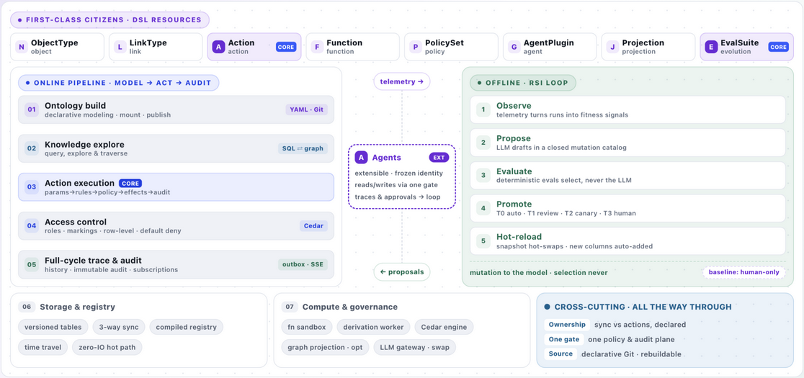

# 01 · Overall Architecture

> Part of [Part I · Architecture](../README.md#part-i--architecture) · Sources: `api/app.py` · `mcp_server.py` · `cli.py` · `engine/service.py` · `action/runtime.py` · `action/outbox.py` etc.

**[中文](../../architecture/01-overall-architecture.md)** | English

## The architecture board at a glance

The board below is the console's **Overview** dashboard (`/`, `ArchBoard` component) — a live, condensed re-draw of this chapter in three horizontal layers. Keep it open while reading; each section below explains one region of the picture.



### How to read the picture

**Layer ① — the top strip: FIRST-CLASS CITIZENS · DSL RESOURCES (violet).**
Eight chips — `ObjectType`, `LinkType`, `Action`, `Function`, `PolicySet`, `AgentPlugin`, `Projection`, `EvalSuite` — are the platform's actual building blocks. Every one of them is a declarative YAML resource in Git (`apiVersion: ontogeny/v1`), so everything shown here can be deleted and rebuilt from the repo at any time. Two chips carry the violet **CORE** tag, and the two tags are the two halves of the governance story:

- **Action — the only write gate.** All writes to the world go through one five-stage runtime (params → rules → policy → effects → audit). There is no second door.
- **EvalSuite — the selection box.** Promotion decisions in the evolution loop are made only by deterministic, reproducible evaluation suites — never by the LLM.

Everything else is replaceable acceleration: HugeGraph, Ollama and Debezium (marked optional/dashed elsewhere) are **not** citizens — unplug them and the platform degrades gracefully instead of stopping.

**Layer ② — the middle band: two engines side by side, joined by an agent spine.**

- **Left card (violet→blue): the ONLINE PIPELINE · MODEL → ACT → AUDIT** — one request's journey through five numbered stages: `01 Ontology build` (declarative modeling · mount · publish; YAML · Git), `02 Knowledge explore` (query, explore & traverse; SQL ⇄ graph), `03 Action execution` (params→rules→policy→effects→audit; the write gate), `04 Access control` (roles · markings · row-level conditions · default deny; Cedar), `05 Full-cycle trace & audit` (history · immutable audit · subscriptions; outbox · SSE). The color gradient is deliberate: violet for the modeling/read sides, blue for the gated write and policy sides.
- **Right card (green): the OFFLINE · RSI LOOP** — the batch evolution cycle outside the request path: `1 Observe` (telemetry turns runs into fitness signals) → `2 Propose` (the LLM drafts inside a closed mutation catalog; out-of-catalog drafts are refused) → `3 Evaluate` (deterministic evals select, never the LLM) → `4 Promote` (T0 auto · T1 review · T2 canary · T3 human) → `5 Hot-reload` (snapshot hot-swaps; new columns auto-added). The card's footer is the constitution in one line: **mutation to the model is outsourced to the model; selection never is** — `baseline: human-only`.
- **The dashed spine between them: Agents (EXT).** The `AgentPlugin` node sits deliberately on a dashed, white-backed box — the dashed frame marks it as coming from *outside* the platform proper. Three lines describe its contract: it is an *extensible plugin with a frozen identity*; its reads and writes still cross the pipeline's very gates (02/03/04); and its *traces & approvals flow back into the loop* — the two dashed pills on the spine, `telemetry →` (runs flow up into Observe) and `← proposals` (promoted models flow back down), are exactly the data flows between the two engines.

**Layer ③ — the bottom band: the supporting layer and the cross-cutting invariants.**

- **`06 Storage & registry`** — versioned object tables (time travel), 3-way sync, the compiled registry with zero-IO hot path.
- **`07 Compute & governance`** — the function sandbox, the derivation worker, the Cedar engine, optional graph projection, swappable LLM gateway.
- **CROSS-CUTTING · ALL THE WAY THROUGH** — the three invariants that hold at every layer: **Ownership** (sync vs actions, declared per property), **One gate** (one policy & audit plane — agents included), **Source** (declarative Git — rebuildable).

**Palette key:** violet = modeling & agents; blue = the gated write & policy sides; green = the loop & assurance. The rest of this chapter walks the same ground in full detail — the board is the map, the chapters are the territory.

## Reading guide

① **First-class citizens** — objects · links · actions · functions · policies · agents · projections · self-evolution are all declarative DSL resources in Git, the platform's actual substance → ② **Offline loop** — the RSI loop (signals → mutations → evals → promotion), with the dashed data-flow pills (↓ injection / ↑ return) annotating direction → ③ **Online main path 01→05**: access & identity → read path (query · explore · traverse) → *03 write path Action (the core)* → side effects & subscriptions (outbox) → ④ the **supporting layer** is called by the main path → ⑤ **cross-cutting mechanisms** span the whole chain. **Dashed = optional/progressive components** (graph projection · LLM gateway); without them the platform still runs.

```
FIRST-CLASS CITIZENS (11 DSL resources · declarative Git · everything rebuildable)
        ▲ machine proposals · same Git channel as humans   │ run traces · telemetry flows back (01 observe) ▼
OFFLINE · model evolution (batch loop off the request path): RSI loop · recursion inside governance
────────────────────────────────────────────────────────────────────────
ONLINE PIPELINE (one request's journey)
  01 access & identity → 02 read path (SQL⇄GRAPH) → 03 write path Action (CORE · the only gate) → 04 side effects & subscriptions
────────────────────────────────────────────────────────────────────────
SUPPORTING (called by the main path): 06 storage & registry · 07 compute & governance
CROSS-CUTTING: property ownership · single governance channel · source-of-truth invariant
```

## First-class citizens (11 DSL resources · declarative Git · everything rebuildable)

| Resource | Layer | Responsibility & key fields |
|---|---|---|
| `ObjectType` | semantic | nouns: `primaryKey` · properties (type / required / **owner** / marking / derived) · backing (store + mapping + sync) |
| `LinkType` | semantic | relations: `cardinality` 1:1 / 1:N / M:N · foreign-key or join-table · navigable, multi-hop traceable |
| `Action` | kinetic | **CORE · the only write gate.** Five stages: parameters → rules → **Cedar policy** → effects → immutable audit; declarative or functional — the one door to the write world |
| `Function` | kinetic | subprocess sandbox: cross-object compute · `ontogeny.llm` · derivation substrate · publishable as a version-anchored API |
| `PolicySet` | governance | Cedar subset: principal × action × resource, row-level conditions · **default deny** · refusals are audited too |
| `AgentPlugin` | agent | agent as a resource: **frozen identity = permission surface** · tool allowlist · approval stance · budget (steps / wall_ms / writes) |
| `Projection` | derived | graph projection is never authoritative: allowlist into the graph · markings never enter · eventually consistent · zero dependency when unused (auto-fallback to SQL recursion) |
| `EvalSuite` · `EvolutionPolicy` | evolution | selection functions are all deterministically evaluable; **the constitution is human-only** (engine / pass bars / markings / ownership / audit) |

First-class citizens = **declarative YAML in Git** (`apiVersion: ontogeny/v1`) — the platform's substance; compiled artifacts can be rebuilt at any time. `Store` / `Ontology` are binding & manifest resources traveling with the package. External components (HugeGraph · Ollama · Debezium) are **not** citizens — they are replaceable accelerators and adapters; not plugging them in means graceful degradation.

## OFFLINE · model evolution (the batch loop off the request path)

**The RSI loop · recursion inside governance** (the constitution cannot self-modify):

1. **① Observe**: 8 telemetry detectors — empty-query rate · unmapped filter fields · hot queries · slow queries P95 · action-rule rejection rate · agent tool errors · approval rejection rate · sync quarantine bad rows → `ontogeny_evolve_signal`
2. **② Diagnose & propose**: deterministic diagnosers produce gaps (with evidence) → `HeuristicProposer` / `LLMProposer` (Ollama structured output, **dropped without rationale**) → `ontogeny_evolve_proposal`
3. **③ Deterministic evaluation**: L1 validate/lint → **L2 EvalSuite** (query regression + action time-travel replay: system-versioned tables = a labeled history set) → L3 shadow double-run → L4 LLM **explains only, never scores**
4. **④ Tiered promotion**: T0 auto-merge (budget 8/week · optional-property additions/enum widening/indexes) · T1 human-reviewed PR (default) · T2 canary (shadow diff + approval) · **T3 constitutional surface, human-only** (policy loosening/marking/ownership/pass bars/migrations)
5. **⑤ Hot reload**: write_package → publish → `sc.reload()`; new optional properties are auto-completed by the DDL layer (`ALTER TABLE ADD COLUMN`), queryable immediately

Inter-band flows: ↓ **machine proposals · the same Git channel as humans**; ↑ **run traces · telemetry returns (01 observe)**.

## ONLINE PIPELINE (one request's journey)

### 01 Access & identity (api/app.py · mcp_server.py · cli.py)

**Three thin shells · one service context**:

| Entry | Description |
|---|---|
| REST | FastAPI, 79 operations (70 paths), OpenAPI contract first |
| MCP | mounted at /mcp (streamable HTTP · JSON); the ontology is the tool surface; sessionful calls funnel into the broker's single gate (any MCP client works: Claude / Cursor / your own agent) |
| CLI | ontogeny: validate/lint/publish/sync/evolve/… |
| Worker | the outbox's four consumers + derivation drain |

**Identity resolution · spans every entry**:

| Scenario | Mechanism |
|---|---|
| dev | `X-Ontogeny-Principal` header (a JSON identity) — demos/CI |
| production | OIDC against the corporate IdP (same interface, swappable) |
| service identity | client_credentials for agents / background jobs |
| ★AgentPlugin | the plugin **carries its own frozen identity** (Role/site is the permission surface); tool catalog and budget stack on top |

Unified error model: `{code, message, details, trace_id}`; stable codes: `RULE_REJECTED` · `POLICY_DENIED` · `REVISION_CONFLICT` · `CONSTITUTION_VIOLATION` — the frontend localizes by code.

### 02 Read path · query / explore / traverse (engine/service.py) — SQL ⇄ GRAPH

**Object query · POST /objects/{type}/query**:

- compiled pushdown: filter/sort/pagination/aggregation → strongly-typed columns (compiled from the DSL)
- assembly: expression derivations computed live on read → marking masks (server-side) → system columns per row (`_rev` optimistic lock)
- relations: link expansion (FK / join-table) · /history time travel

**Neighborhood explore · POST /graph/explore**:

- random entry: uniform sampling over active rows of all types (seed reproducible)
- ★depth-first: explicit frame stack + per-frame cursor; backtracking resumes the parent frame's remaining branches — no neighbor skipped
- bounded: N≤200 · depth≤6 · bidirectional dedup · `truncated` flag

**Path traverse · POST /graph/traverse**: explicit link chains expanded hop by hop (material→BOM→product); depth routing: ≤2 hops SQL, ≥3 hops → HugeGraph projection, **auto-fallback to SQL recursion when unavailable**.

Read-side invariants: expression derivations are computed read-only, never stored; masks applied at the assembly layer, not the frontend; **the action decision path never reads the projection** (eventually consistent).

### 03 Write path · the Action runtime (action/runtime.py) — CORE · the only write gate

**Five stages · execute(action, principal, params, target)**:

| Stage | Description |
|---|---|
| ① parameters | strongly validated/coerced against DSL types; unknown parameters rejected |
| ② rules | mini-expr evaluated **inside the transaction against the latest state** (prevents concurrent duplicate moves); refusal writes a revision + throws `RULE_REJECTED` after commit |
| ③ policy | Cedar: principal × action × resource with row-level conditions (same plant); default deny; refusals are audited |
| ★④ effects | 7 kinds (see below); declarative = expressions, functional = an effect plan (`{"$expr":…}` marked explicitly), atomically executed after uniform type coercion |
| ⑤ audit | immutable revisions: principal/params/before-after/rule hits/policy verdicts; **refusals are audited too**; idempotency-key replays return the first result |

**The seven effects (what changes)**: `modify-target` · `modify-linked` · `create-object` · `archive-object` (soft delete) · `set-link` · `webhook` (outbound) · `emit-event`. Transactional effects first, external ones via the outbox; `modify-linked` also emits outbox events for the linked objects (the derivation re-compute trigger).

**Authoring style × governance strength**:

| Style | Description |
|---|---|
| Declarative | rules + effects all in YAML (default, statically checkable) |
| Functional | `execution: {kind: function}` — the function returns an effect plan, **never writes directly** |
| Strength | immediate · approval · scheduled (v1) · reversible (compensated from version history) |

Concurrency correctness in three pieces: ① `expected_revision` optimistic lock → 409 · ② `idempotency_key` replay · ③ rules evaluated inside the transaction (no distributed lock needed).

### 04 Side effects & subscriptions (action/outbox.py)

**OUTBOX · asynchronous delivery after commit**:

| Consumer | Description |
|---|---|
| webhook | outbound allowlist (anti-SSRF) · `${VAR}` resolved at delivery time — missing config **never rolls back the business transaction**; fix and replay |
| projection | row changes → HugeGraph vertex/edge upserts (monotonic per object by outbox id) |
| derivation | enqueues objects for recompute → drain materializes function-derived properties in batch |
| sse | real-time push at /subscriptions |
| cursors | the four consumers keep **independent cursors** — one failing never stalls the others; rewind to replay |

Ops entry points: `POST /admin/outbox/dispatch` · `POST /admin/derive` force materialization · `POST /admin/sync/{type}` · `GET /audit/revisions`.
Key convention: side-effect failures never drag the business transaction; an unconfigured webhook only warns and consumes — replay after fixing.

Between the main path and the supporting layer: **calls / reads & writes · results return (02 read + 03 write depend on it throughout)**.

## SUPPORTING · the supporting layer (called by the main path)

### 06 Storage & registry (stores/ · registry/)

- **Object tables · system-versioned**: `_rev` optimistic lock · `_valid_from/_valid_to` time travel · composite primary keys · `UTCDateTime` timezone fidelity. Append-only: update = close old version + insert new; expression derivations take no column, function derivations materialize with **version carry-over**; new optional columns are added by automatic ALTER
- **Sync engine · three strategies**: `snapshot` full & idempotent · `watermark` incremental · `changelog` consuming Debezium (external · Kafka). Four iron laws: atomic idempotent batches · at-least-once · explicit deletion semantics · **bad rows quarantined, never blocking the batch** (bad-row rate = an RSI signal); schema drift → alert & stop writing, mapping changes go through PRs
- **Registry · compiled snapshots**: publish = validate + persist + compile. content_hash version keys · in-process cache (zero IO on the hot path) · rebuilt from the DB on restart · lineage DAG · **Cedar text persisted with the metadata (a restart used to default-deny — fixed)**
- **Demo bootstrap · ontogeny.demo + demo_story**: `seed/*.sql` nouns · `demo-story.yaml` verbs · refusals are part of the plot. serve --demo: seed → copy the sqlite-ized package → build UI → sync → replay the story → project → derive

### 07 Compute & governance (functions/ · policy/ · projection/)

- **Function sandbox · subprocess isolation**: `ontogeny.query` read-only inside capability · `ontogeny.llm` gateway-routed · rlimits + wall-clock process kill · PYTHONDONTWRITEBYTECODE. stdio JSON-RPC; **map_rows** batch mode; returned objects are API-shaped (derived properties visible — a sandbox-reads-zero miscalculation was fixed)
- **Derivation worker · function-derived materialization**: triggered by outbox + `triggers` cross-object declarations (a new maintenance order → the equipment's counter recomputes); execution = one subprocess for the whole batch → one transaction writes the column; semantics = eventually consistent · produces no revisions · action decisions never read it
- **Cedar policy · subset engine**: `permit when{…}` → mini-expr (`resource`→`target`, single-expression semantics); unmatched = default deny; refusals audited; marking properties replaced by sentinels at the assembly layer
- **HugeGraph projection · optional derived** (external · Apache HugeGraph): DSL→schema compilation · Loader backfill · outbox increments · markings never enter. Five invariants: derived is never authoritative · allowlist into the graph · eventually consistent · no duplicated authorization · enabled on demand (zero dependency when undeclared)
- **Deployment shapes**: demo `ontogeny serve --demo` · standard compose · graph-enhanced (+hugegraph profile) · cloud-native Helm (workers on separate queues)
- **LLM gateway · platform-level** (external · Apache Ollama): `ONTOGENY_LLM_BASE_URL / ONTOGENY_LLM_MODEL` (OpenAI-compatible, swappable); **four consumers** all go through the gateway: ① assistant chat (grounding on to_meta, propose mode drafts changes) ② the RSI proposer (structured {mutations, rationale}; dropped without rationale) ③ the `ontogeny.llm` function (sandbox stdio RPC forward, budget-capped) ④ **BuiltinLlmEngine** (the agent session's tool-selection loop); unconfigured → assistant/engine return 503 gracefully, **everything else is unaffected**

## CROSS-CUTTING · mechanisms that span the whole chain

| Mechanism | Description |
|---|---|
| Property-level ownership · source / ontology | `source` (default) is fully owned by sync, actions may not touch it; `ontology` is seeded once and then owned by actions. **Once an action takes over, sync never overwrites again** — declaratively killing the classic "full push wipes action state" incident |
| Single governance channel · no second door | REST / MCP / CLI / Worker share one `ServiceContext`: the same transactions, Cedar and audit. Agents inherit the plugin identity; **no privileged bypass exists** |
| Source-of-truth invariant · everything rebuildable | The Git DSL is the only authority: object-table schemas, graph schemas, doc exports are all compiled artifacts or projections — **delete them and rebuild at will** — the precondition for adopting any external framework |

## Third-party components (integrated · what they do · degradation without them)

| Component | Where | What the platform uses it for | When absent / unconfigured |
|---|---|---|---|
| **Ollama** (third-party LLM server) | supporting layer · LLM gateway (`ontogeny/llm`) | the single outlet for four consumers: assistant chat (ontology grounding) · the RSI proposer (structured mutations) · the `ontogeny.llm` function (budget-capped) · **BuiltinLlmEngine** (the agent tool loop) | assistant/engine return 503 with a hint; **everything else works** (provider swappable without touching function code) |
| **MCP clients** (third-party agent runtimes: Claude/Cursor/in-house) | consumer layer · `/mcp` + AgentPlugin | call the tool catalog under the plugin's frozen identity (search/act/call/traverse), bounded by session budget, approval gates and audit | none connected = no external agents; the platform's read/write paths are unaffected |
| **Apache HugeGraph** (graph database) | supporting layer · graph projection (`ontogeny/projection`) | the accelerator for ≥3-hop traversals and graph algorithms; outbox incremental sync | automatic fallback to SQL recursive traversal (functionally equivalent); the platform starts with zero dependencies |
| **Debezium + Kafka** (CDC capture) | data plane · changelog sync source | delete-aware incremental sync | replaced by snapshot / watermark strategies (covers 90% of cases) |
