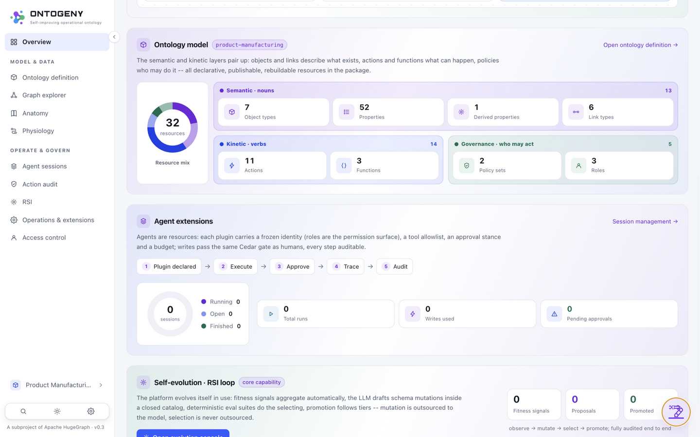

# 08 · Quick Start（QUICK START · ONE COMMAND）

> Part of [Part II · Usage](../README.md#part-ii--usage)

**[中文](../../zh/usage/08-quickstart.md)** | English

## 8.1 One command

```bash
uv venv && source .venv/bin/activate && uv pip install -e .
cd web && npm install && cd ..
ontogeny serve --demo --open        # → http://127.0.0.1:8000/ (UI and API on one port)
# optionally attach an LLM (shared by the assistant + the RSI proposer):
ONTOGENY_LLM_BASE_URL=http://<ollama>:11434 ONTOGENY_LLM_MODEL=qwen3:27b ontogeny serve --demo --open
```

`--demo` generates a self-contained directory `.ontogeny-demo/` (erp.db seeded source + pkg/ ontology copy + metadata database); it survives restarts, `--reseed` rebuilds it, and the demo story replays automatically on first boot. Container deployment: `docker compose up -d`. Already have a domain package? Sidebar domain switcher → **New domain → Import ontology package**, upload a zip (e.g. `domains/product-manufacturing.zip`) — validate-install-activate in one step.

## 8.2 First login

A fresh deployment auto-creates an `admin` account; the initial password is printed to the server log (or preset via `ONTOGENY_ADMIN_PASSWORD`). After logging in you land on the Overview dashboard: Ontogeny intro & overall architecture, the ontology model, agents and the RSI loop — four sections on one screen.



**Overview (the landing page)** — the first screen is the Ontogeny introduction with the overall architecture board; the left rail is the global navigation (Model & data / Operate & govern); the dashboard numbers come from the real compiled snapshot and seeded data, not static decoration.
