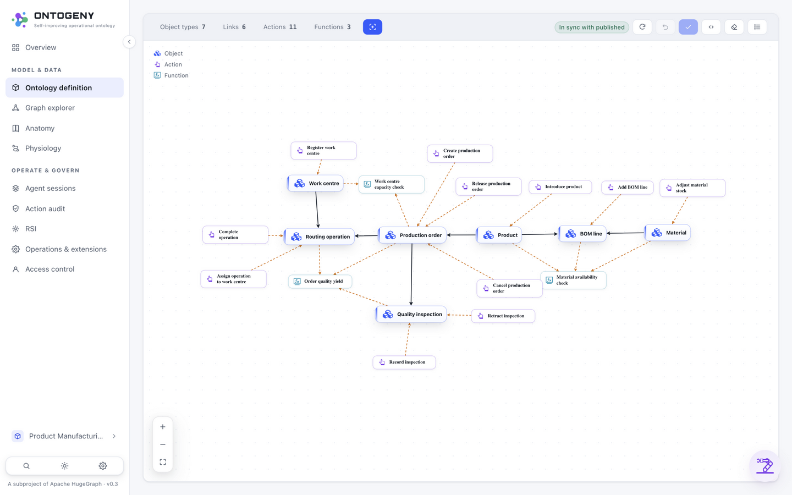
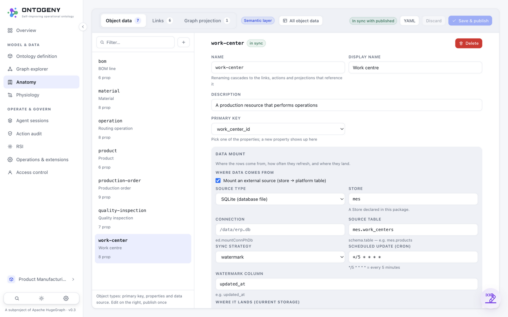
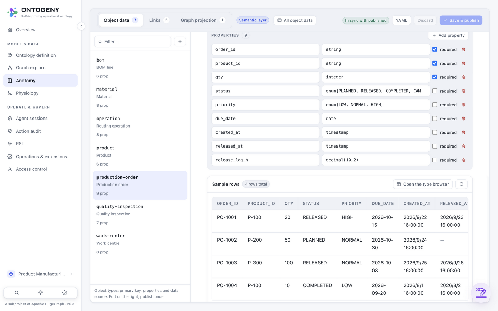
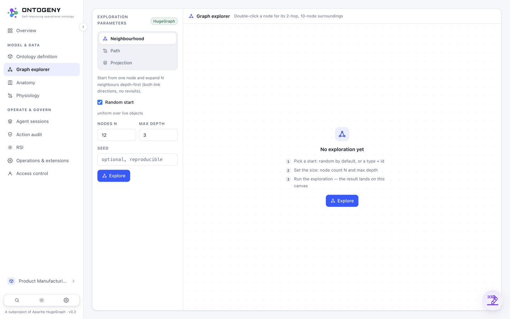
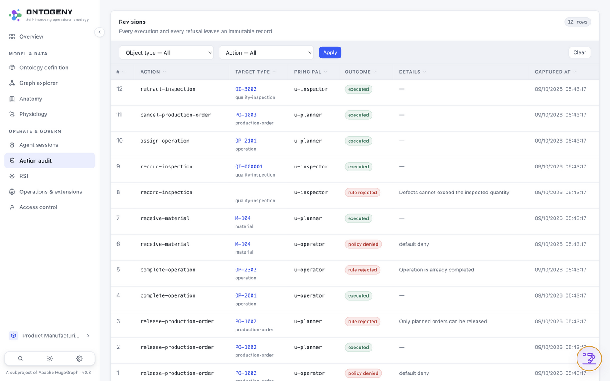
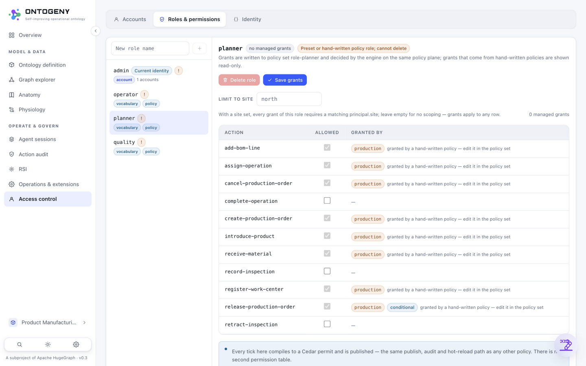

# 09 · UI Tour（UI TOUR · SCREENSHOTS）

> Part of [Part II · Usage](../README.md#part-ii--usage)

**[中文](../../zh/usage/09-ui-tour.md)** | English

Six high-frequency pages covering the daily path "model → data → trace → govern". All screenshots come from a real running demo instance (`ontogeny serve --demo`, the product-manufacturing sample domain).

## ① Ontology definition (/ontology)

Types, actions, functions and links on a card canvas: entities / actions / functions are distinguishable at a glance, hovering highlights references; the canvas layout publishes together with the save.

## ② Semantic editing (/knowledge)

Resources in the left column, in-place forms on the right: properties / primary key / data mount; "Save & publish" at the top runs the validate-compile-persist pipeline; discard anything before saving.

## ③ Object data (the Knowledge page · Object data tab)

Type switching, server-side pagination and filtering; marked (marking) properties are masked by the current identity — the same page shows different data to different identities, the policy surface made visible in the UI.

## ④ Graph explorer (/graph)

Neighborhood exploration (depth-first, reproducible seeds) and explicit path traversal; data comes from the HugeGraph projection, same source as the object API.

## ⑤ Action audit (/audit)

The immutable revision stream: who, when, which resource, before/after; function code edits are audited too (`edit-function-source`).

## ⑥ Access control (/access)

The role × action grant matrix reads and writes the managed Cedar policy set directly; grants coming from hand-written policies are shown read-only locked — it never pretends to revoke someone else's permit.
