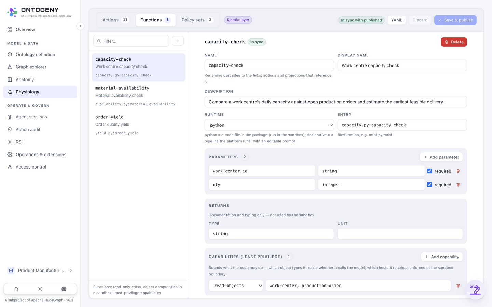
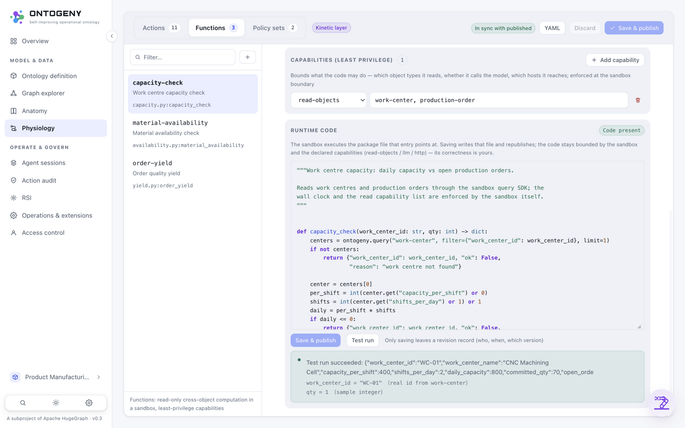

# 10 · The Function Editor（FUNCTION EDITOR · PYTHON IN THE SANDBOX）

> Part of [Part II · Usage](../README.md#part-ii--usage)

**[中文](../../zh/usage/10-function-editor.md)** | English

Only functions with a **python** runtime show the "Run code" section (declarative functions encode their logic as step orchestration, edited in the Steps area above). The editor reads and writes the real file inside the package:
**Test run** executes the current code once — nothing written, nothing traced; only **Save & publish** writes the file, producing a new version and a revision record.

## Steps

1. **Open a function** — the Action page → Functions tab → pick any python function (e.g. "Work centre capacity check"). The editor loads the package file `entry` points at, with **Python syntax highlighting** (keywords/strings/comments/numbers colorized).
2. **Empty-function bootstrap** — for a new function with no code file yet, the editor generates an **annotated code skeleton**: the signature matches the declared Parameters, and comments explain `ontogeny.query` (bounded by the read-objects capability) and `ontogeny.llm`; saving creates the file and publishes.
3. **Test run** — click "Test run": the platform generates inputs automatically (defaults → real primary keys → type samples, **each parameter labeled with its source**) and executes once in the sandbox; functions declaring llm/http really call the model or the outside. The result panel shows the return value or the failure — **no file writes, no publish, no revision record**.
4. **Save & publish** — when satisfied: a syntax check first (errors never reach disk), then the package file is written and a new version published; every save leaves a revision record (who / when / which version), viewable under "Revision history".

## Screenshots

**Editing** — Python syntax highlighting; "Save & publish" and "Test run" as two separate buttons; a badge on the right shows whether the code file exists. The sandbox boundary (read-objects / llm / http capabilities) is enforced at edit time.

**The test-run result** — the return value is immediately visible; the input panel labels each parameter's source (e.g. `work_center_id = "WC-01" (real id from work-center)`), so results are trustworthy and explainable.
