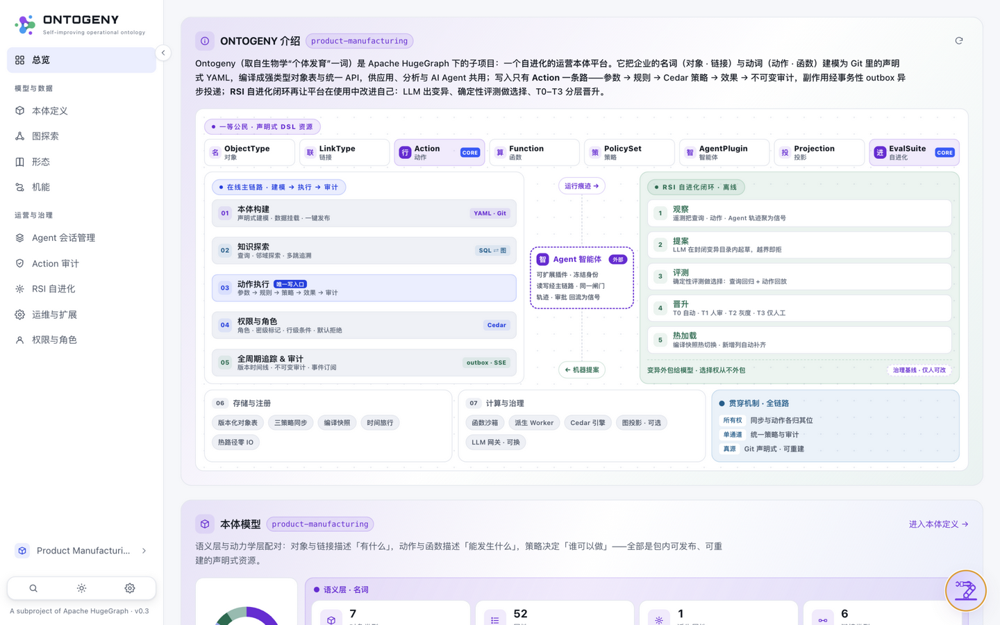

# 08 · 快速开始（QUICK START · ONE COMMAND）

> 所属：[使用文档](../README.md#第二部分--使用文档part-ii--usage)

**中文** | [English](../en/usage/08-quickstart.md)


## 8.1 一条命令启动

```bash
uv venv && source .venv/bin/activate && uv pip install -e .
cd web && npm install && cd ..
ontogeny serve --demo --open        # → http://127.0.0.1:8000/（UI 与 API 同端口）
# 可选接大模型（助手 + RSI 提案器共用）：
ONTOGENY_LLM_BASE_URL=http://<ollama>:11434 ONTOGENY_LLM_MODEL=qwen3:27b ontogeny serve --demo --open
```

`--demo` 生成自包含目录 `.ontogeny-demo/`（erp.db 播种源库 + pkg/ 本体副本 + 元数据库）；重启保留，`--reseed` 重建，首次启动自动重放演示剧本。容器部署：`docker compose up -d`。已有现成领域包？侧栏域切换器 → **新域 → 导入本体包**，上传 zip（如 `domains/product-manufacturing.zip`）即可校验-安装-激活一步完成。

## 8.2 首次登录

全新部署会自动创建管理员 `admin`，初始密码打印在服务日志（或预先设置 `ONTOGENY_ADMIN_PASSWORD`）。登录后落在运行看板：Ontogeny 介绍与总体架构、本体模型、智能 Agent 与 RSI 自进化闭环四个区块一屏可览。



**运行看板（登录后首页）** —— 首屏即 Ontogeny 介绍与总体架构图；左侧为全局导航（模型与数据 / 运营与治理），看板数字来自真实编译快照与种子数据，非静态装饰。
