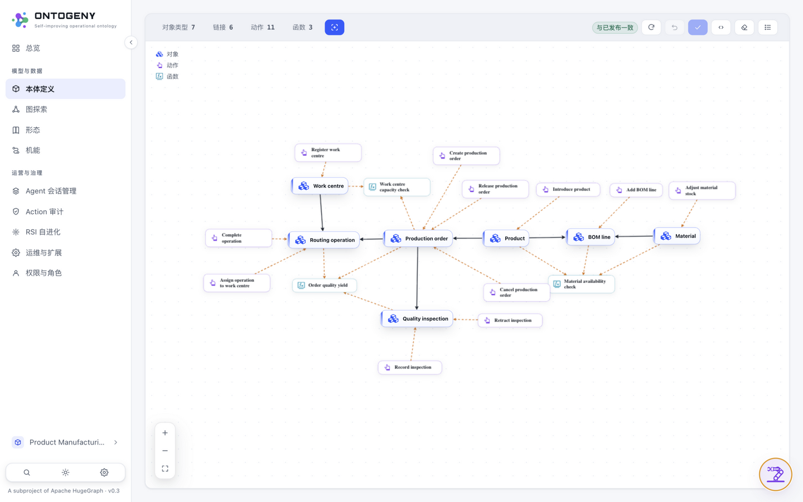
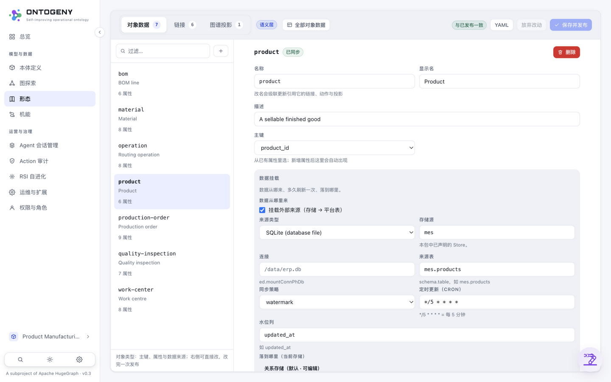
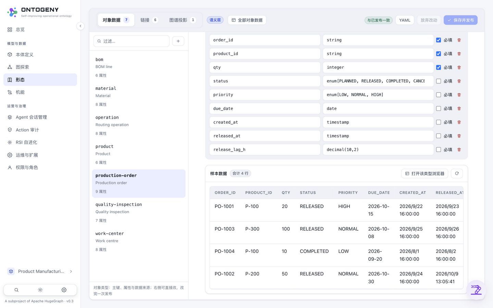
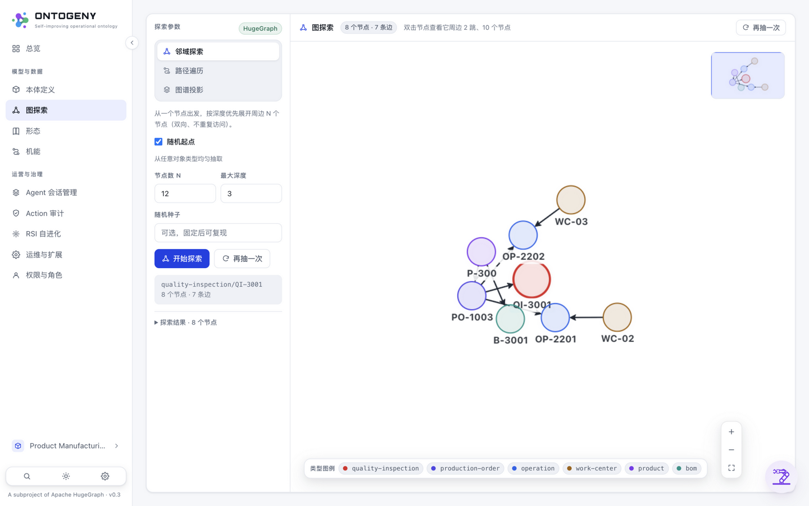
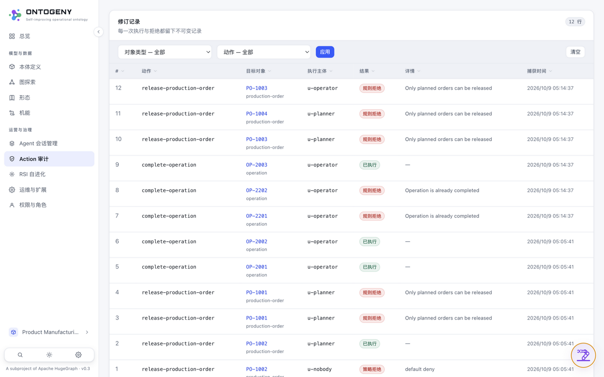
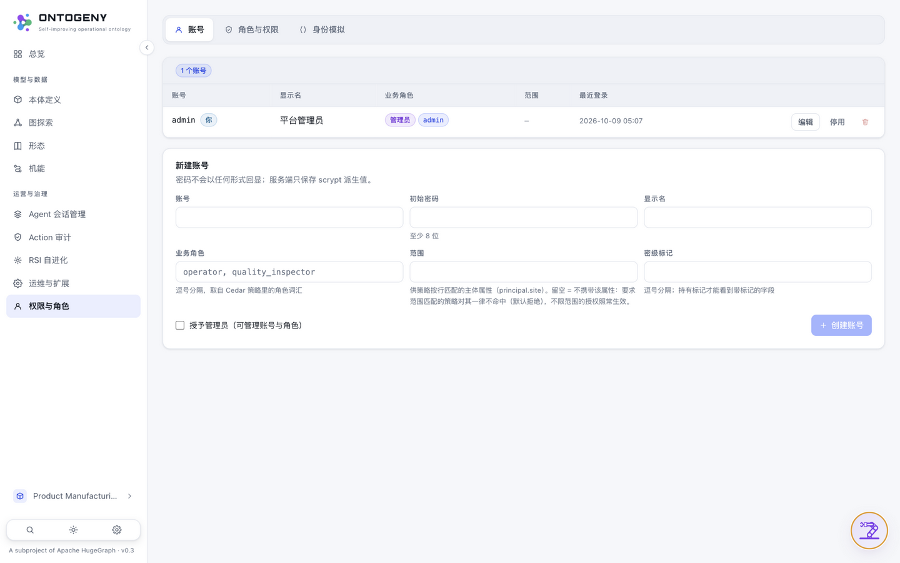

# 09 · 界面导览（UI TOUR · SCREENSHOTS）

> 所属：[使用文档](../README.md#第二部分--使用文档part-ii--usage)

**中文** | [English](../en/usage/09-ui-tour.md)

六个高频页面，覆盖「建模 → 数据 → 追溯 → 治理」的日常动线。全部截图取自真实运行的演示实例（`ontogeny serve --demo`，product-manufacturing 样例域）。

## ① 本体浏览器（/ontology）

类型、动作、函数、链接以卡片画布呈现：实体/动作/函数三种形态一眼可分，悬停高亮引用关系；画布布局随保存一起发布。

## ② 语义层编辑（/knowledge）

左列资源、右侧表单原位编辑：属性/主键/物化开关；顶部「保存并发布」走校验-编译-落盘三段式，未保存前可丢弃。

## ③ 对象数据（Knowledge 页 · Object data 标签）

类型切换、服务端分页与过滤；标记（marking）属性按当前身份自动掩码，同一页面换身份看到的数据不同——策略面在 UI 上可见。

## ④ 图探索（/graph）

邻域探索（深度优先、可复现种子）与显式路径遍历；数据来自 HugeGraph 投影，读路径与对象 API 同源。

## ⑤ 审计（/audit）

不可变修订流：谁、何时、改了哪个资源、before/after；函数代码编辑同样入审计（`edit-function-source`）。

## ⑥ 权限与角色（/access）

角色 × 动作授权矩阵直接读写受管 Cedar 策略集；手工策略授予只读锁定显示，不假装能撤销别人的 permit。
