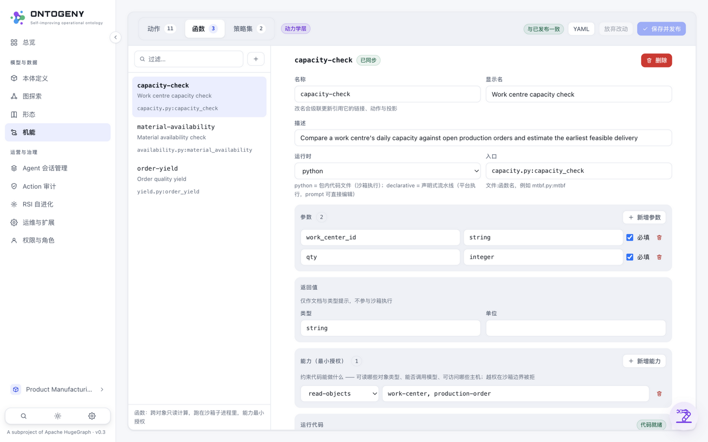
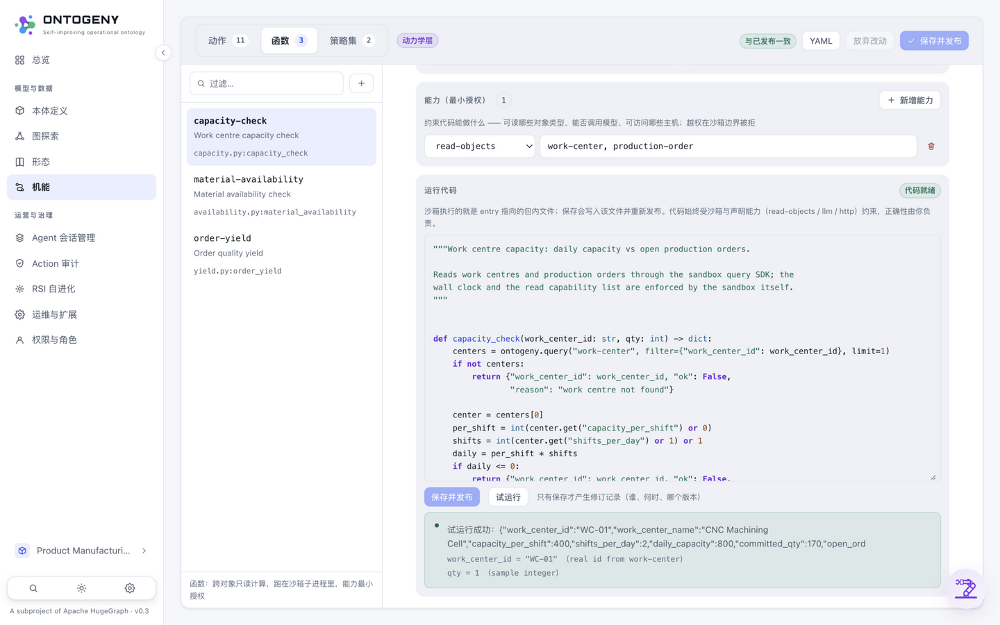

# 10 · 函数编辑器实战（FUNCTION EDITOR · PYTHON IN THE SANDBOX）

> 所属：[使用文档](../README.md#第二部分--使用文档part-ii--usage)

**中文** | [English](../en/usage/10-function-editor.md)

Runtime 为 **python** 的函数才显示「运行代码」区（declarative 函数的逻辑就是步骤编排，在上方 Steps 区编辑）。编辑器直接读写包内真实文件：
**试运行**（Test run）把当前代码跑一次、不落盘不留痕；**保存并发布**才写文件、产生新版本与修订记录。

## 操作步骤

1. **打开函数** —— Action 页 → Functions 标签 → 任选 python 函数（如「产能校验」）。编辑器加载 `entry` 指向的包内文件，带 **Python 语法高亮**（关键字/字符串/注释/数字分色）。
2. **空函数引导** —— 新建函数尚无代码文件时，编辑器自动生成**带注释的代码骨架**：函数签名与 Parameters 声明一致，注释讲解 `ontogeny.query`（受 read-objects 能力约束）与 `ontogeny.llm` 的用法；保存即创建文件并发布。
3. **试运行** —— 点击「试运行」：平台自动生成输入（默认值 → 真实主键 → 类型样例，**每个参数标注来源**），在沙箱里真实执行一次；声明了 llm/http 的函数会真的调用模型或外部接口。结果面板显示返回值或失败原因——**不写文件、不发布、不留修订记录**。
4. **保存并发布** —— 满意后点「保存并发布」：先做语法检查（错误绝不落盘），再写入包内文件并重新发布新版本；每次保存留下一条修订记录（谁/何时/哪个版本），可在「修订历史」展开查看。

## 截图

**编辑态** —— Python 语法高亮；「保存并发布」与「试运行」两个独立按钮；右侧徽标显示代码文件是否就绪。沙箱边界（read-objects / llm / http 能力）在编辑期持续生效。

**试运行结果** —— 返回值即时可见；参数面板标注每个输入的来源（如 `work_center_id = "WC-01"（来自 work-center 的真实主键）`），结果可信可解释。
