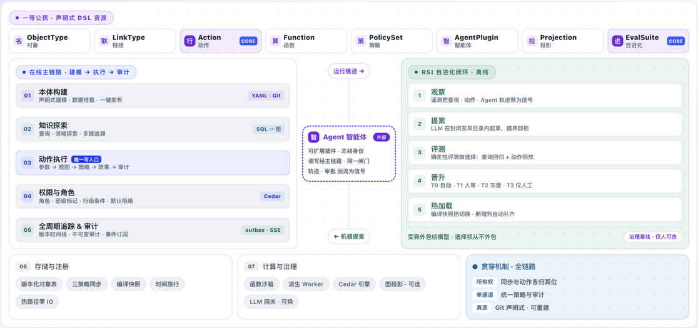

# 01 · 总览架构图（OVERALL ARCHITECTURE）

> 所属：[架构文档](../README.md#第一部分--架构文档part-i--architecture) · 源：`api/app.py` · `mcp_server.py` · `cli.py` · `engine/service.py` · `action/runtime.py` · `action/outbox.py` 等

**中文** | [English](../../en/architecture/01-overall-architecture.md)

## 架构总览图

下图是控制台**首页 Overview**（`/`，`ArchBoard` 组件）的实时架构板——本章内容压缩重绘成三层横向布局。建议阅读时对照此图，下文每一节都在解释图中的一个区域。



### 怎么读这张图

**第 ① 层 · 顶部横条：一等公民 · 声明式 DSL 资源（紫色）。**
八枚芯片——`ObjectType`、`LinkType`、`Action`、`Function`、`PolicySet`、`AgentPlugin`、`Projection`、`EvalSuite`——是平台真正的构成主体。每一枚都是 Git 里的声明式 YAML 资源（`apiVersion: ontogeny/v1`），图上的一切随时可以删掉、从仓库重建。其中两枚带紫色 **CORE** 标签，两个标签正好是治理故事的两半：

- **Action——唯一写入口。** 对世界的所有写入都走同一个五段式运行时（参数 → 规则 → 策略 → 效果 → 审计），没有第二扇门。
- **EvalSuite——选择框。** 自进化循环里的晋升决策只由确定性的、可复现的评测套件做出，LLM 永远不判分。

其余外部组件（HugeGraph、Ollama、Debezium，在图中以可选/虚线标注）都只是**可替换的加速器**：拔掉它们平台优雅降级，而不是停摆。

**第 ② 层 · 中部：两个引擎并排，由 Agent 中枢串联。**

- **左侧卡片（紫→蓝）：在线主链路 · 建模 → 执行 → 审计**——一次请求的五段旅程：`01 本体构建`（声明式建模 · 数据挂载 · 一键发布；YAML · Git）→ `02 知识探索`（查询 · 邻域探索 · 多跳追溯；SQL ⇄ 图）→ `03 动作执行`（参数→规则→策略→效果→审计；写入口）→ `04 权限与角色`（角色 · 密级标记 · 行级条件 · 默认拒绝；Cedar）→ `05 全周期追踪 & 审计`（版本时间线 · 不可变审计 · 事件订阅；outbox · SSE）。配色是刻意的：紫色代表建模/读侧，蓝色代表受治理的写侧与策略侧。
- **右侧卡片（绿色）：RSI 自进化闭环 · 离线**——请求路径之外的批量进化循环：`1 观察`（遥测把查询 · 动作 · Agent 轨迹聚为信号）→ `2 提案`（LLM 在封闭变异目录内起草，越界即拒）→ `3 评测`（确定性评测做选择：查询回归 + 动作回放）→ `4 晋升`（T0 自动 · T1 人审 · T2 灰度 · T3 仅人工）→ `5 热加载`（编译快照热切换 · 新增列自动补齐）。卡片底部一行字就是宪法：**变异外包给模型，选择权从不外包**——`治理基线 · 仅人可改`。
- **两者之间的虚线脊柱：Agent 智能体（外部）。** `AgentPlugin` 节点刻意画成虚线白底盒子——虚线框标记它来自平台之外。三行小字是它的全部契约：*可扩展插件 · 冻结身份*；*读写经主链路 · 同一闸门*（仍要走 02/03/04 的关卡）；*轨迹 · 审批 回流为信号*。脊柱上的两枚虚线胶囊 `运行痕迹 →`（运行流水向上进入观察）与 `← 机器提案`（晋升后的模型回流主链路），正是两个引擎之间的全部数据流。

**第 ③ 层 · 底部：支撑层与贯穿不变量。**

- **`06 存储与注册`**——版本化对象表（时间旅行）、三策略同步、编译快照（热路径零 IO）。
- **`07 计算与治理`**——函数沙箱、派生 Worker、Cedar 引擎、图投影（可选）、LLM 网关（可换）。
- **贯穿机制 · 全链路**——每一层都成立的三条不变量：**所有权**（同步与动作各归其位，按属性声明）、**单通道**（统一策略与审计面，Agent 也在内）、**真源**（Git 声明式 · 可重建）。

**配色图例：** 紫 = 建模与智能体；蓝 = 受治理的写侧与策略侧；绿 = 循环与保障。本章其余部分展开同样的内容的完整细节——架构板是地图，正文章节是疆域。

## 导读

① **一等公民**——对象 · 链接 · 动作 · 函数 · 策略 · 智能体 · 投影 · 自进化，全部是 Git 里的声明式 DSL 资源，是平台的构成主体 → ② **离线闭环**——RSI 自进化（信号→变异→评测→晋升），带间**数据流胶囊**（↓注入 / ↑回流）标注流向 → ③ **在线主链路 01→04**：接入与身份 → 读路径（查询·探索·追溯）→ **03 写路径 Action（核心）** → 副作用与订阅（outbox）→ ④ **支撑层**被主链路调用 → ⑤ **贯穿机制**覆盖全链路。**虚线 = 可选/渐进组件**（图投影 · LLM 网关），缺省时平台照常运行。

```
FIRST-CLASS CITIZENS · 一等公民（11 种 DSL 资源 · Git 声明式 · 一切可重建）
        ▲ 机器提案 · 与人类同 Git 通道          │ 运行痕迹 · 遥测回流（01 观察）▼
OFFLINE · 模型演进（主链路之外的批量闭环）：RSI 自进化闭环 · 治理内递归
────────────────────────────────────────────────────────────────────────
ONLINE PIPELINE · 在线主链路（一次请求的旅程）
  01 接入与身份 → 02 读路径（SQL⇄GRAPH）→ 03 写路径 Action（CORE 唯一写入口）→ 04 副作用与订阅
────────────────────────────────────────────────────────────────────────
SUPPORTING · 支撑层（被主链路调用）：06 存储与注册 · 07 计算与治理
CROSS-CUTTING · 贯穿机制：属性级所有权 · 单治理通道 · 真源不变量
```

## 一等公民（11 种 DSL 资源 · Git 声明式 · 一切可重建）

| 资源 | 层 | 职责与关键字段 |
|---|---|---|
| `ObjectType` 对象 | 语义 | `primaryKey` · properties（类型 / required / **owner** / marking / derived）· backing（store + mapping + sync） |
| `LinkType` 链接 | 语义 | `cardinality` 1:1 / 1:N / M:N · foreign-key 或 join-table · 可导航、可多跳追溯 |
| `Action` 动作 | 动力学 | **CORE · 唯一写入口**。五段式：参数 → 规则 → **Cedar 策略** → 效果 → 不可变审计；声明式或函数型，写世界只此一门 |
| `Function` 函数 | 动力学 | 子进程沙箱：跨对象计算 · `ontogeny.llm` · 函数派生底层 · 可发布为带版本锚定的 API |
| `PolicySet` 策略 | 治理 | Cedar 子集：主体 × 动作 × 资源，行级条件 · **默认拒绝** · 拒绝同样留痕 |
| `AgentPlugin` 智能体 | Agent | Agent 即资源：**冻结身份 = 权限面** · 工具白名单 · 审批模式 · 预算（steps / wall_ms / writes） |
| `Projection` 投影 | 派生 | 图投影非权威：白名单进图 · marking 禁入 · 最终一致 · 未启用零依赖（自动降级 SQL 递归） |
| `EvalSuite` · `EvolutionPolicy` | 自进化 | 选择函数全部确定性可求值；**宪法仅人可改**（引擎 / 评分线 / marking / 所有权 / 审计） |

一等公民 = **Git 里的声明式 YAML**（`apiVersion: ontogeny/v1`）——平台的构成主体，编译产物可随时重建。另 `Store` / `Ontology` 为绑定与清单资源，随包同行。外部组件（HugeGraph · Ollama · Debezium）**不是公民**，是可替换的加速器与适配器——不接入即降级。

## OFFLINE · 模型演进（主链路之外的批量闭环）

**RSI 自进化闭环 · 治理内递归**（宪法不可自改）：

1. **① 观察**：telemetry 检测器 8 种——查询空结果率 · 未建模过滤字段 · 热点查询 · 慢查询 P95 · 动作规则拒绝率 · Agent 工具错误 · 审批拒绝率 · 同步隔离区坏行 → `ontogeny_evolve_signal`
2. **② 诊断提案**：确定性诊断器产出缺口（附证据）→ `HeuristicProposer` / `LLMProposer`（Ollama 结构化输出，**无 rationale 即丢弃**）→ `ontogeny_evolve_proposal`
3. **③ 确定性评测**：L1 validate/lint → **L2 EvalSuite**（查询回归 + 动作时间旅行回放：系统版本化表 = 带标签历史集）→ L3 影子双跑 → L4 LLM **只解释不判分**
4. **④ 分层晋升**：T0 自动合并（预算 8/周 · 新增可选属性/枚举扩域/索引）· T1 人审 PR（默认）· T2 灰度（影子 diff + 审批）· **T3 宪法面仅人工**（策略放宽/标记/所有权/评分线/迁移）
5. **⑤ 热加载**：write_package → publish → `sc.reload()`；新增可选属性由 DDL 层自动 `ALTER TABLE ADD COLUMN` 补齐，即刻可查

带间数据流：↓ **机器提案 · 与人类同 Git 通道**；↑ **运行痕迹 · 遥测回流（01 观察）**。

## ONLINE PIPELINE · 在线主链路（一次请求的旅程）

### 01 接入与身份（api/app.py · mcp_server.py · cli.py）

**三个薄壳 · 一个服务上下文**：

| 入口 | 说明 |
|---|---|
| REST | FastAPI，79 操作（70 路径），OpenAPI 契约先行 |
| MCP | 挂载于 /mcp（streamable HTTP · JSON），本体即工具面，带会话调用汇入 broker 唯一门（外部 · MCP 客户端均可接入：Claude / Cursor / 自研 Agent） |
| CLI | ontogeny：validate/lint/publish/sync/evolve/… |
| Worker | outbox 四消费者 + 派生 drain |

**身份解析 · 贯穿所有入口**：

| 场景 | 方式 |
|---|---|
| dev | `X-Ontogeny-Principal` 头（JSON 身份）— 演示/CI |
| 生产 | OIDC 对接企业 IdP（接口一致可替换） |
| 服务身份 | client_credentials 供 Agent / 后台 |
| ★AgentPlugin | 插件**自带冻结身份**（Role/site 即权限面），工具目录与预算叠加其上 |

统一错误模型：`{code, message, details, trace_id}`；稳定码：`RULE_REJECTED` · `POLICY_DENIED` · `REVISION_CONFLICT` · `CONSTITUTION_VIOLATION`，前端按码给本地化解释。

### 02 读路径 · 查询 / 探索 / 追溯（engine/service.py）— SQL ⇄ GRAPH

**对象查询 · POST /objects/{type}/query**：

- 编译下推：filter/sort/分页/聚合 → 强类型列（DSL 编译产物）
- 装配：表达式派生读取时实时计算 → marking 掩码（服务端）→ 系统列随行（_rev 乐观锁）
- 关系：link 展开（FK / join-table）· /history 时间旅行

**邻域探索 · POST /graph/explore**：

- 随机起点：全类型活跃行均匀抽取（seed 可复现）
- ★深度优先：显式帧栈 + 每帧游标：回溯时恢复父帧剩余分支，不跳过任何邻居
- 限幅：N≤200 · 深度≤6 · 双向不重复 · `truncated` 标记

**路径追溯 · POST /graph/traverse**：显式链接链逐跳展开（物料→BOM→产品）；跳深路由：≤2 跳 SQL，≥3 跳 → HugeGraph 投影，**不可用自动降级 SQL 递归**。

读侧不变量：派生表达式只读计算不落库 · 掩码在装配层非前端 · **动作决策路径永不读投影**（最终一致）。

### 03 写路径 · Action 运行时（action/runtime.py）— CORE · 唯一写入口

**五段式 · execute(action, principal, params, target)**：

| 段 | 说明 |
|---|---|
| ① 参数 | 按 DSL 类型强校验/强转，未知参数拒绝 |
| ② 规则 | mini-expr 在**事务内对最新状态求值**（防并发重复迁移）；拒绝写修订 + 提交后抛 `RULE_REJECTED` |
| ③ 策略 | Cedar：主体 × 动作 × 资源，行级条件（同厂区）· 默认拒绝；拒绝留痕 |
| ★④ 效果 | 7 类（见下）；声明式=表达式，函数型=效果计划（`{"$expr":…}` 显式标记），统一类型强转后原子执行 |
| ⑤ 审计 | 不可变修订：主体/参数/前后态/规则命中/策略裁决；**拒绝同样留痕**；幂等键重放返首次结果 |

**效果七类（改什么）**：`modify-target` 改目标 · `modify-linked` 联动改关联 · `create-object` 创建 · `archive-object` 软删 · `set-link` 链接成员 · `webhook` 出站 · `emit-event` 事件。事务性在前 · 外部在后（outbox）；`modify-linked` 联动对象也发 outbox 事件（派生重算触发源）。

**编写方式 × 治理强度**：

| 方式 | 说明 |
|---|---|
| 声明式 | 规则+效果全在 YAML（默认，静态可校验） |
| 函数型 | `execution: {kind: function}`——函数返回效果计划，**永不直接写库** |
| 强度 | 即时 · 审批 · 定时（v1）· 可撤销（按版本历史补偿） |

并发正确性三件套：① `expected_revision` 乐观锁 → 409 · ② `idempotency_key` 幂等重放 · ③ 规则事务内求值（无需分布式锁）。

### 04 副作用与订阅（action/outbox.py）

**OUTBOX · 事务提交后异步投递**：

| 消费者 | 说明 |
|---|---|
| webhook | 出站白名单（防 SSRF）· `${VAR}` 投递时才解析——配置缺失**不回滚业务事务**，修好可重放 |
| projection | 行变更 → HugeGraph 点边 upsert（同对象按 outbox id 单调） |
| derivation | 入队待重算对象 → drain 批量物化函数派生属性 |
| sse | /subscriptions 实时推送 |
| 游标 | 四消费者**各自独立游标**，失败互不拖累，回退即重放 |

运维入口：`POST /admin/outbox/dispatch` · `POST /admin/derive` 强制物化 · `POST /admin/sync/{type}` · `GET /audit/revisions`。
关键约定：副作用失败永不拖累业务事务；webhook 未配只告警并消费，修复后重放。

主链路与支撑层之间：**调用 / 读写 · 结果返回（02 读 + 03 写全程依赖）**。

## SUPPORTING · 支撑层（被主链路调用）

### 06 存储与注册（stores/ · registry/）

- **对象表 · 系统版本化**：`_rev` 乐观锁 · `_valid_from/_valid_to` 时间旅行 · 复合主键 · `UTCDateTime` 时区保真。追加式：更新=关旧版+插新版；表达式派生不落列，函数派生物化落列且**版本结转**；新增可选属性自动 ALTER 补列
- **同步引擎 · 三策略**：`snapshot` 全量幂等 · `watermark` 水位增量 · `changelog` Debezium 消费（外部 · Kafka）。四铁律：原子幂等 · at-least-once · 删除显式 · **坏行进隔离区不阻塞批次**（坏行率 = RSI 信号）；schema 漂移 → 告警停写，mapping 走 PR
- **注册表 · 编译快照**：publish = 校验+持久化+编译。content_hash 版本键 · 进程缓存（热路径零 IO）· 重启从 DB 重建 · 血缘 DAG · **Cedar 文本随元数据持久化（修复过重启即 default-deny）**
- **演示引导 · ontogeny.demo + demo_story**：`seed/*.sql` 名词 · `demo-story.yaml` 动词 · 拒绝也是剧情。serve --demo：播种 → 复制 sqlite 化包 → 构建 UI → sync → 重放故事 → 投影 → 派生

### 07 计算与治理（functions/ · policy/ · projection/）

- **函数沙箱 · 子进程隔离**：`ontogeny.query` 能力内只读 · `ontogeny.llm` 网关路由 · rlimits + 墙钟杀进程 · PYTHONDONTWRITEBYTECODE。stdio JSON-RPC；**map_rows** 批量模式；返回对象与 API 同形（派生属性可见——修复过沙箱读 0 错算）
- **派生 Worker · 函数派生物化**：触发 = outbox + `triggers` 跨对象声明（新维修单 → 设备计数重算）；执行 = 整批一次子进程逐行求值 → 单事务落列；语义 = 最终一致 · 不产修订 · 动作决策不读它
- **Cedar 策略 · 子集引擎**：`permit when{…}` → mini-expr（`resource`→`target`，单一表达式语义）；未命中 = 默认拒绝；拒绝留痕；marking 属性装配层替换哨兵
- **HugeGraph 投影 · 可选派生**（外部 · Apache HugeGraph）：DSL→schema 编译 · Loader 回填 · outbox 增量 · marking 禁入。五不变量：派生非权威 · 白名单进图 · 最终一致 · 授权不重复 · 按需启用（不声明零依赖）
- **部署形态**：Demo `ontogeny serve --demo` · 标准 compose · 图增强（+hugegraph profile）· 云原生 Helm（worker 分队列）
- **LLM 网关 · 平台级**（外部 · Apache Ollama）：`ONTOGENY_LLM_BASE_URL / ONTOGENY_LLM_MODEL`（OpenAI 兼容可换）；**四处消费**统一走网关：① 助手对话（grounding on to_meta，propose 模式出变更草案）② RSI 提案器（结构化 {mutations, rationale}，无 rationale 丢弃）③ 函数 `ontogeny.llm`（沙箱 stdio RPC 转发，预算限次）④ **BuiltinLlmEngine**（Agent 会话的工具选择循环）；未配置 → 助手/引擎 503 优雅提示，**其余功能不受影响**

## CROSS-CUTTING · 贯穿机制

| 机制 | 说明 |
|---|---|
| 属性级所有权 · source / ontology | `source`（默认）同步全权、动作不得改；`ontology` 仅播种、动作接管。**动作一旦接管，同步永不回踩**——声明式解决"全量推送冲掉动作状态"的经典事故 |
| 单治理通道 · 没有第二扇门 | REST / MCP / CLI / Worker 共用 `ServiceContext`：同一套事务、Cedar、审计。Agent 继承插件身份；**不存在特权旁路** |
| 真源不变量 · 一切可重建 | Git DSL 是唯一权威：对象表结构、图 schema、文档导出全是编译产物或投影，**删掉可随时重建**——引入任何外部框架的前提 |

## 第三方组件位（已接入 · 各自做什么 · 未接入时的降级）

| 外部组件 | 接入位置 | 平台用它做什么 | 未接入 / 未配置时 |
|---|---|---|---|
| **Ollama**（第三方 LLM 服务端） | 支撑层 · LLM 网关（`ontogeny/llm`） | 四个消费点的唯一出口：助手对话（本体 grounding）· RSI 提案器（结构化变异）· 函数 `ontogeny.llm`（预算限次）· **BuiltinLlmEngine**（Agent 工具选择循环） | 助手/引擎返回 503 并提示配置；**其余功能全部正常**（provider 可换，函数代码不动） |
| **MCP 客户端**（第三方 Agent 运行时：Claude/Cursor/自研） | 消费层 · `/mcp` + AgentPlugin | 以插件冻结身份调用工具目录（search/act/call/traverse），受该会话预算、审批门与审计约束 | 不接即无外部 Agent；平台读写字径不受影响 |
| **Apache HugeGraph**（图数据库） | 支撑层 · 图投影（`ontogeny/projection`） | ≥3 跳深遍历与图算法的加速引擎；outbox 增量同步 | 自动降级 SQL 递归遍历（功能等价），平台零依赖启动 |
| **Debezium + Kafka**（CDC 采集） | 数据面 · changelog 同步源 | 删除感知的增量同步 | 用 snapshot / watermark 策略替代（覆盖 90% 场景） |
